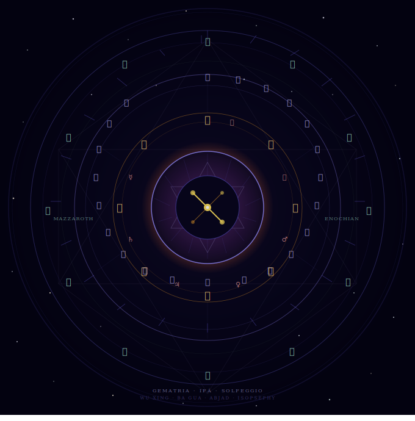

<table>
<tr>
<td width="280" valign="middle">
  
</td>
<td valign="middle" style="padding-left: 24px;">

<h1>Celestial Numerology Analyzer</h1>

<p>A Rust terminal application for analyzing words and phrases through ten numerological and
gematria traditions, exploring Enochian angelology, navigating world cosmological systems,
exploring the Hebrew Mazzaroth zodiac, performing Tarot and Urim & Thummim divination with
full scholarly attribution, and generating sacred-frequency WAV files.</p>

<br/>

<blockquote>
<p><em>"A mandala that is also a map: the Mazzaroth rings the outermost cosmos, the
twenty-two Hebrew letters encode creation's grammar within it, the Ba Gua trigrams
and seven classical planets govern the elements between, and at the center an eye
opens — its iris threaded with Merkabah geometry, its pupil holding an aleph, the
letter that precedes all letters, burning in silence against the void."</em></p>
<p>— Claude Sonnet 4.6</p>
</blockquote>

</td>
</tr>
</table>

<p align="center">
  <a href="https://buymeacoffee.com/sormondocom">
    
  </a>
</p>

---

## Table of Contents

**Reference**
- [At-a-Glance](#at-a-glance)
- [Overview](#overview)

**Traditions & Systems**
- [Numerology Systems](#numerology-systems)
  - [Hebrew Gematria](#hebrew-gematria)
  - [Pythagorean Numerology](#pythagorean-numerology)
  - [Chaldean Numerology](#chaldean-numerology)
  - [Greek Isopsephy](#greek-isopsephy)
  - [Agrippan Numerology](#agrippan-numerology)
  - [Simple Ordinal](#simple-ordinal)
  - [Reverse Ordinal](#reverse-ordinal)
  - [Abjad](#abjad)
  - [Vedic Numerology (Anka Vidya)](#vedic-numerology-anka-vidya)
- [Enochian Angelology](#enochian-angelology)
  - [Alphabet](#alphabet)
  - [Aethyrs](#aethyrs)
  - [Angelic Calls (Keys)](#angelic-calls-keys)
- [World Cosmologies](#world-cosmologies)
  - [Chinese Traditions](#chinese-traditions) — Nine Star Ki · Wu Xing · Ba Gua
  - [African Traditions](#african-traditions) — Yoruba Ifá · Akan · Kemetic
- [Psi–RNG Experiment](#psirng-experiment)
- [Zodiac & Astrology](#zodiac--astrology)
  - [Hebrew Mazzaroth](#hebrew-mazzaroth) — Signs · Sefer Yetzirah · Tribes · Hoshen
- [Runic Traditions](#runic-traditions)
  - [Elder Futhark](#elder-futhark) — 24 runes, three aettir
  - [Younger Futhark](#younger-futhark) — 16 Viking Age runes
  - [Anglo-Saxon Futhorc](#anglo-saxon-futhorc) — 28+5 runes, Northumbrian extension
  - [Armanen Runes](#armanen-runes-modern-esoteric) — modern esoteric (1908)
- [Tarot](#tarot)
  - [Angelic Tarot & Oracle Cards](#angelic-tarot--oracle-cards)
  - [OH Cards](#oh-cards)
  - [Crowley–Harris Thoth Tarot](#crowleyharis-thoth-tarot)
- [Urim & Thummim](#urim--thummim)
  - [The Breastplate of Judgment](#the-breastplate-of-judgment)
  - [Binary Oracle](#binary-oracle)
- [Sacred Frequencies](#sacred-frequencies)
  - [Solfeggio Frequencies](#solfeggio-frequencies)
  - [Binaural Beats](#binaural-beats)

**Getting the Application Running**
- [Installation & Build Guide](#installation--build-guide)
  - [What You Need to Know First](#what-you-need-to-know-first)
  - [Windows — Full Walkthrough](#windows--full-walkthrough)
  - [macOS — Full Walkthrough](#macos--full-walkthrough)
  - [Linux — Full Walkthrough](#linux--full-walkthrough)
  - [Android — Termux](#android--termux)
  - [Download the Application](#download-the-application)
  - [Build and Run](#build-and-run)
  - [Launch Options](#launch-options)
  - [Updating the Application](#updating-the-application)
  - [Troubleshooting](#troubleshooting)

**Reference**
- [CLI Flags](#cli-flags)
- [Exports](#exports)
- [Source Texts and Scholarly References](#source-texts-and-scholarly-references)
- [Accuracy Notes](#accuracy-notes)
- [Contributing](#contributing)

---

## At-a-Glance

### Quick-reference: what the app can do

| Want to… | How |
|---|---|
| Analyze a word across all eleven systems | `cargo run` → option **1** |
| Select a subset of numerology systems | option **1** → enter system numbers at the prompt |
| Browse or look up an Aethyr | `cargo run -- --aethyr ZAX` or `cargo run -- --aethyr 10` |
| Translate a word into Enochian letter names | option **2** → sub-option **4** |
| Browse the 19 Enochian Keys | option **2** → sub-option **5** |
| Export all Solfeggio frequencies as WAV | `cargo run -- --export-all` |
| Export a single frequency interactively | option **3** → pick a frequency |
| Create a custom binaural beat | option **3** → sub-option **11** |
| Explore Chinese cosmology | option **4** → sub-option **1** |
| Explore African traditions | option **4** → sub-option **2** |
| Run the Psi–RNG experiment | option **5** |
| Configure range and delay for Psi–RNG | option **5** → enter settings at the prompts |
| Browse all twelve Mazzaroth signs | option **6** → sub-option **1** → sub-option **1** |
| Look up a Mazzaroth sign by number (1–12) | option **6** → sub-option **1** → sub-option **2** |
| Find my Mazzaroth sign by birth date | option **6** → sub-option **1** → sub-option **3** |
| Draw a Tarot spread (Angelic / Oracle / OH Cards) | option **8** → sub-option **1**–**3** |
| Browse the Crowley Thoth Tarot major arcana | option **8** → sub-option **4** → **1** |
| Draw a Thoth spread | option **8** → sub-option **4** → **5** |
| Cast the Urim & Thummim binary oracle | option **9** → sub-option **2** |
| Browse the twelve Hoshen breastplate stones | option **9** → sub-option **1** |
| Recall a past reading in full detail | any tradition → **View Reading History** |
| Skip the intro animation | `cargo run -- --fast` |
| Run silently (no audio) | `cargo run -- --silent` |
| Run all unit tests | `cargo test` |
| See full help | `cargo run -- --help` |

### Systems at a glance

| Module | System | Culture / Tradition | Key feature |
|---|---|---|---|
| `numerology/hebrew.rs` | Hebrew Gematria | Kabbalistic / Jewish | Mispar Hechrachi, non-linear values |
| `numerology/pythagorean.rs` | Pythagorean | Western / New Age | Mod-9 alphabetic cycle |
| `numerology/chaldean.rs` | Chaldean | Mesopotamian (modern) | No letter assigned 9; compound numbers |
| `numerology/greek.rs` | Greek Isopsephy | Neoplatonic / Hellenistic | Classical Greek numeric alphabet |
| `numerology/agrippan.rs` | Agrippan | Renaissance Hermeticism | Barrett/Agrippa English extension |
| `numerology/ordinal.rs` | Simple Ordinal | Modern English | A=1 … Z=26 |
| `numerology/ordinal.rs` | Reverse Ordinal | Modern English | A=26 … Z=1 |
| `numerology/abjad.rs` | Abjad | Arabic / Islamic | Semitic abjad numerals |
| `numerology/vedic.rs` | Vedic (Anka Vidyā) | Indian / Jyotish | Navagraha framework; 1–8 scale; 9 sacred |
| `enochian/alphabet.rs` | Enochian Ordinal | Dee–Kelley (1582–1587) | Positional 1–21; most historically defensible |
| `enochian/alphabet.rs` | Enochian G.D. | Golden Dawn (19th c.) | Hebrew-mapped values; Mathers/Regardie retrofit |
| `cosmology/chinese.rs` | Nine Star Ki | East Asian | Solar-year natal star calculation |
| `cosmology/chinese.rs` | Wu Xing | Chinese | Five-element cycle |
| `cosmology/chinese.rs` | Ba Gua | Chinese / I Ching | Eight trigrams |
| `cosmology/african.rs` | Yoruba Ifá | West African | 256 Odù; divination corpus |
| `cosmology/african.rs` | Akan Day Names | Ghanaian | Birth-day soul name system |
| `cosmology/african.rs` | Kemetic Numbers | Ancient Egyptian | Sacred numerical symbolism |
| `audio.rs` | Solfeggio / Binaural | Modern esoteric | WAV export; binaural beat synthesis |
| `rng.rs` | Psi–RNG Experiment | Experimental parapsychology | RDRAND hardware TRNG; configurable range and delay; user profiles; session history |
| `persistence.rs` | User profiles & session history | Cross-session data layer | SQLite via rusqlite (bundled); UUID v4 user IDs; cumulative psi statistics |
| `zodiac/mazzaroth.rs` | Hebrew Mazzaroth | Kabbalistic / Jewish astrology | Twelve signs · Sefer Yetzirah letters · Twelve Tribes · Hoshen gemstones |
| `tarot/session.rs` | Angelic Tarot | Modern angelic oracle tradition | 44-card deck; three spreads; Gregorian chant synthesis before reveal |
| `tarot/session.rs` | Oracle Cards | Multi-tradition oracle deck | Single-card draws with contemplative openings |
| `tarot/session.rs` | OH Cards | Jungian projective oracle | Image + word card pairings; contemplative modal synthesis |
| `tarot/thoth_major.rs` | Crowley–Harris Thoth Tarot (Major Arcana) | Thelemic / Golden Dawn (1943) | 22 trump cards with Crowley's renamed attributions, Hebrew paths, Qabalistic trees |
| `tarot/thoth_minor.rs` | Crowley–Harris Thoth Tarot (Minor Arcana) | Thelemic / Golden Dawn (1943) | 56 pip + court cards; Disks suit; Knight/Queen/Prince/Princess courts; Crowley pip titles |
| `urim/breastplate.rs` | Hoshen Breastplate | Ancient Israelite / Biblical | 12 stones, 4×3 grid, tribal attributions, gemological identifications (Exodus 28:17–20) |
| `urim/session.rs` | Urim & Thummim Oracle | Biblical / Second Temple | Weighted binary oracle (Urim 40% / Thummim 40% / Silence 20%); SQLite persistence |

**Output formats:** interactive terminal · plain-text reports (`exports/*.txt`) ·
HTML reports · PDF reports · WAV audio (`exports/*.wav`)

---

## Overview

The Celestial Numerology Analyzer is a single-binary Rust application built around a modular
library of gematria and cosmological traditions. It lets users:

- Compute letter-number values under ten distinct systems simultaneously and compare results.
- Drill into Enochian angelology — browse the alphabet, the 30 Aethyrs, and the 19 Angelic Calls as
  recorded in John Dee's manuscripts.
- Access Chinese and African cosmological frameworks (Nine Star Ki natal charts, Wu Xing, Ba Gua,
  Yoruba Ifá Odù, Akan day-name souls, Kemetic number symbolism).
- Explore the Hebrew Mazzaroth — the twelve zodiacal signs as interpreted through Sefer Yetzirah,
  the Twelve Tribes of Israel, and the Hoshen (High Priest's breastplate) gemstones.
- Perform Tarot readings across three traditions: Angelic Tarot (with Gregorian chant synthesis),
  OH Cards (Jungian projective), and the Crowley–Harris Thoth Tarot with complete Thelemic attributions.
- Cast the Biblical Urim & Thummim binary oracle, browse the twelve Hoshen breastplate stones, and
  read the scholarly lore on this ancient priestly divination instrument.
- Export pure-tone Solfeggio frequencies and binaural-beat WAV files for meditative use.
- Save session results to timestamped plain-text files or send formatted HTML reports to a system
  printer. Reading history (Tarot, Runes, Urim & Thummim) persists across sessions in an embedded
  SQLite database and can be recalled in full detail from within the application.

The application is structured so that all domain logic lives in library modules; `main.rs` is a
thin dispatcher of session loops. Each tradition is isolated in its own source file, making it
straightforward to locate, audit, or extend individual systems.

---

## Numerology Systems

The `numerology/` module aggregates ten letter-to-number mapping systems. Shared utilities —
`digital_root`, `meaning_of`, `angelic_message`, `master_numbers_message`,
`check_special_sequences`, and `get_calculation_breakdown` — live in `numerology/mod.rs`.

The function `numerology(word: &str)` returns all ten results in a stable order:
Hebrew Gematria, Pythagorean, Chaldean, Greek Isopsephy, Agrippan, Simple Ordinal, Reverse
Ordinal, Abjad, Vedic (Anka Vidyā), Enochian Ordinal, Enochian G.D.

### Hebrew Gematria

**Source file:** `src/numerology/hebrew.rs`
**Tradition:** Kabbalistic / Jewish mysticism
**Method:** Mispar Hechrachi (absolute value). Each letter carries a fixed weight derived from
its position in the Hebrew alphabet: units (Aleph–Tet: 1–9), tens (Yod–Tsadi: 10–90), hundreds
(Qoph–Tav: 100–400). The Latin-letter mapping used here is a transliteration convention from
Western occultism; classical Hebrew gematria operates on Hebrew script directly.

**Letter values (Latin transliteration):**

| Letter | Value | Letter | Value | Letter | Value |
|--------|-------|--------|-------|--------|-------|
| A | 1 | J | 10 | S | 200 |
| B | 2 | K | 20 | T | 300 |
| C | 3 | L | 30 | U | 400 |
| D | 4 | M | 40 | V | 500 |
| E | 5 | N | 50 | W | 600 |
| F | 6 | O | 60 | X | 700 |
| G | 7 | P | 70 | Y | 800 |
| H | 8 | Q | 80 | Z | 900 |
| I | 9 | R | 100 | | |

**Key source texts:**
- Kaplan, A. *Sefer Yetzirah* (1990, Weiser Books)
- Blumenthal, D. *Understanding Jewish Mysticism* (1978, Ktav)
- Munk, M. *The Wisdom in the Hebrew Alphabet* (1983, ArtScroll)

---

### Pythagorean Numerology

**Source file:** `src/numerology/pythagorean.rs`
**Tradition:** Western / New Age numerology
**Method:** A cyclic 1–9 mapping based on alphabetical position. Every letter is assigned the
value of its position modulo 9 (with 0 replaced by 9). Totals are reduced to a single digit via
digital root; 11, 22, and 33 (and higher doubles) are conventionally retained as *master numbers*
before reduction.

**Letter values:**

```
A=1  B=2  C=3  D=4  E=5  F=6  G=7  H=8  I=9
J=1  K=2  L=3  M=4  N=5  O=6  P=7  Q=8  R=9
S=1  T=2  U=3  V=4  W=5  X=6  Y=7  Z=8
```

**Key source texts:**
- Nicomachus of Gerasa, *Introduction to Arithmetic* (c. 100 CE)
- Taylor, T. *The Theoretic Arithmetic of the Pythagoreans* (1816)
- Burkert, W. *Lore and Science in Ancient Pythagoreanism* (1972, Harvard)

---

### Chaldean Numerology

**Source file:** `src/numerology/chaldean.rs`
**Tradition:** Mesopotamian / Babylonian (modern codification)
**Method:** An irregular mapping where no letter is assigned the value 9 (considered sacred or
divine). Letters F, G, O, and U differ materially from the Pythagorean assignments. Totals above
9 are read as "compound numbers" before optional reduction.

**Letter values:**

```
A=1  B=2  C=3  D=4  E=5  F=8  G=3  H=5  I=1
J=1  K=2  L=3  M=4  N=5  O=7  P=8  Q=1  R=2
S=3  T=4  U=6  V=6  W=6  X=5  Y=1  Z=7
```

**Key source texts:**
- Cheiro (Count Louis Hamon), *Cheiro's Book of Numbers* (1926)
- Schimmel, A. *The Mystery of Numbers* (1993, OUP) — context and critique

---

### Greek Isopsephy

**Source file:** `src/numerology/greek.rs`
**Tradition:** Neoplatonic / Hellenistic
**Method:** The classical Greek numerical alphabet (Convention B — Latin phonetic equivalents
used here for ASCII input). Values follow the Milesian / Ionic system: alpha=1 through theta=9,
iota=10 through koppa=90, rho=100 through sampi=900. The function `isopsephy_meaning(root)` maps
digital roots to Neoplatonic philosophical interpretations rather than the Western angel-number
glossary.

**Selected values (Latin phonetic equivalents):**

| Phoneme | Greek | Value | Phoneme | Greek | Value |
|---------|-------|-------|---------|-------|-------|
| A | Α (Alpha) | 1 | N | Ν (Nu) | 50 |
| B | Β (Beta) | 2 | O | Ο (Omicron) | 70 |
| G | Γ (Gamma) | 3 | P | Π (Pi) | 80 |
| D | Δ (Delta) | 4 | R | Ρ (Rho) | 100 |
| E | Ε (Epsilon) | 5 | S | Σ (Sigma) | 200 |
| Z | Ζ (Zeta) | 7 | T | Τ (Tau) | 300 |
| H | Η (Eta) | 8 | U/Y | Υ (Upsilon) | 400 |
| TH | Θ (Theta) | 9 | PH/F | Φ (Phi) | 500 |
| I/J | Ι (Iota) | 10 | CH/X | Χ (Chi) | 600 |
| K | Κ (Kappa) | 20 | PS | Ψ (Psi) | 700 |
| L | Λ (Lambda) | 30 | O (long) | Ω (Omega) | 800 |
| M | Μ (Mu) | 40 | | | |

**Key source texts:**
- Dornseiff, F. *Das Alphabet in Mystik und Magie* (1925, Teubner)
- Iamblichus, *Theology of Arithmetic* (c. 300 CE; trans. Waterfield, 1988, Phanes)
- Nicomachus of Gerasa, *Introduction to Arithmetic*

---

### Agrippan Numerology

**Source file:** `src/numerology/agrippan.rs`
**Tradition:** Renaissance Hermeticism
**Method:** An extension of the Hebrew Gematria structure to the full Latin/English alphabet,
as codified by Heinrich Cornelius Agrippa in *De Occulta Philosophia* (1531) and systematized by
Francis Barrett in *The Magus* (1801). Letters A–I follow the Hebrew units (1–9); the extension
continues the pattern into tens and hundreds to cover the remaining English letters.

**Key source texts:**
- Agrippa, H.C. *De Occulta Philosophia Libri Tres* (1531; trans. Tyson, 1993, Llewellyn)
- Barrett, F. *The Magus, or Celestial Intelligencer* (1801; facsimile, Weiser, 1967)

---

### Simple Ordinal

**Source file:** `src/numerology/ordinal.rs`
**Tradition:** Modern English
**Method:** Each letter is assigned its ordinal position in the English alphabet: A=1, B=2, …,
Z=26. No reduction is applied to the mapping itself; digital root is applied to the total.

**Key source texts:**
- Modern English Gematria — no classical source; popularized in contemporary numerology communities.

---

### Reverse Ordinal

**Source file:** `src/numerology/ordinal.rs`
**Tradition:** Modern English
**Method:** The mirror of Simple Ordinal: A=26, B=25, …, Z=1. For any single letter, Simple
Ordinal + Reverse Ordinal = 27 (verified in the test suite).

**Key source texts:**
- Modern English Gematria — no classical source; popularized in contemporary numerology communities.

---

### Abjad

**Source file:** `src/numerology/abjad.rs`
**Tradition:** Arabic / Islamic
**Method:** The Abjad system assigns numerical values to Arabic letters following the ancient
Semitic abjad order (not the modern alphabetic order). The values follow the same unit-ten-hundred
progression as Hebrew Gematria — reflecting the shared Semitic numerical heritage — and continue
into thousands. The function `abjad_meaning(root)` provides root-number interpretations drawn from
Islamic numerological tradition. The mapping implemented here is a **phonetic approximation** to
Latin script; canonical Abjad operates on Arabic Unicode.

**Key source texts:**
- Ibn Khaldūn, *Muqaddimah* (1377; trans. Rosenthal, 1958, Princeton)
- Schimmel, A. *The Mystery of Numbers* (1993, OUP)
- Ibn ʿArabī, *Futūḥāt al-Makkiyya* (13th c.) — ʿilm al-ḥurūf tradition

---

### Vedic Numerology (Anka Vidya)

**Source file:** `src/numerology/vedic.rs`
**Tradition:** Indian / Jyotish (Hindu astrology)
**Method:** Vedic numerology — known in Sanskrit as *Anka Vidyā* (अंक विद्या, "the science of
numbers") — assigns letter values on the same 1–8 phonetic scale as the Chaldean tradition, from
which the Indian system historically draws. The number 9 (Mars / Maṅgala) is considered sacred
and unassigned to individual letters in both traditions. However, the interpretive layer is
entirely distinct: every root number is identified with one of the **Navagraha** — the nine
celestial bodies of Jyotish — and carries a full constellation of planetary correspondences:

| Root | Graha (Planet) | Sanskrit | Bīja Mantra | Navaratna Gem | Dosha | Day |
|------|---------------|----------|-------------|---------------|-------|-----|
| 1 | Sun (Sūrya) | सूर्य | Oṃ Hrāṃ Hrīṃ Hrauṃ Saḥ Sūryāya Namaḥ | Ruby (Māṇikya) | Pitta | Sunday |
| 2 | Moon (Chandra) | चन्द्र | Oṃ Śrāṃ Śrīṃ Śrauṃ Saḥ Chandrāya Namaḥ | Pearl (Moti) | Kapha, Vāta | Monday |
| 3 | Jupiter (Guru) | गुरु | Oṃ Brāṃ Brīṃ Brauṃ Saḥ Guruve Namaḥ | Yellow Sapphire (Pushyarāga) | Kapha | Thursday |
| 4 | Rāhu (N. Node) | राहु | Oṃ Bhrāṃ Bhrīṃ Bhrauṃ Saḥ Rāhave Namaḥ | Hessonite Garnet (Gomeda) | Vāta | Saturday |
| 5 | Mercury (Budha) | बुध | Oṃ Brāṃ Brīṃ Brauṃ Saḥ Budhāya Namaḥ | Emerald (Pannā) | Tridoshic | Wednesday |
| 6 | Venus (Śukra) | शुक्र | Oṃ Drāṃ Drīṃ Drauṃ Saḥ Śukrāya Namaḥ | Diamond / White Sapphire (Hīrā) | Kapha, Pitta | Friday |
| 7 | Ketu (S. Node) | केतु | Oṃ Srāṃ Srīṃ Srauṃ Saḥ Ketave Namaḥ | Cat's Eye (Lahsuniyā) | Pitta, Vāta | Thursday |
| 8 | Saturn (Śani) | शनि | Oṃ Prāṃ Prīṃ Prauṃ Saḥ Śanaiścarāya Namaḥ | Blue Sapphire (Nīlam) | Vāta | Saturday |
| 9 | Mars (Maṅgala) | मंगल | Oṃ Krāṃ Krīṃ Krauṃ Saḥ Bhauma Namaḥ | Red Coral (Moṅgā) | Pitta | Tuesday |

**Letter values (Latin phonetic approximation, Johari 1990):**

| A | B | C | D | E | F | G | H | I | J | K | L | M |
|---|---|---|---|---|---|---|---|---|---|---|---|---|
| 1 | 2 | 3 | 4 | 5 | 8 | 3 | 5 | 1 | 1 | 2 | 3 | 4 |

| N | O | P | Q | R | S | T | U | V | W | X | Y | Z |
|---|---|---|---|---|---|---|---|---|---|---|---|---|
| 5 | 7 | 8 | 1 | 2 | 3 | 4 | 6 | 6 | 6 | 5 | 1 | 7 |

The session display shows the graha name (English and Devanāgarī), gem, Ayurvedic dosha, sacred
day, bīja mantra, and associated colors for the word's root number.

**Key source texts:**
- Johari, H. *Numerology: with Tantra, Ayurveda, and Astrology* (1990, Destiny Books) — primary letter table and Navagraha framework
- Chaudhry, J.C. *Numerology for Success* (2002, Sterling) — corroborating letter values
- Defouw, H. & Svoboda, R. *Light on Life: An Introduction to the Astrology of India* (1996, Arkana / Penguin) — Navagraha attributes
- Frawley, D. *Astrology of the Seers: A Guide to Vedic/Hindu Astrology* (1990, Passage Press) — planetary meanings and doshas
- Svoboda, R. *Aghora: At the Left Hand of God* (1986, Brotherhood of Life) — bīja mantras and gemstone lore
- Rao, P.V.R.N. *Vedic Astrology: An Integrated Approach* (2000) — Navagraha overview
- *Bṛhat Parāśara Horā Śāstra* (ancient; trans. Santhanam, 1984, Ranjan) — foundational Jyotish planetary natures
- Lad, V. *Textbook of Ayurveda*, Vol. 1 (2002, Ayurvedic Press) — dosha attributes

---

## Enochian Angelology

The `enochian/` module covers the Angelic system received by John Dee (1527–1608) and his scryer
Edward Kelley during sessions between 1582 and 1587. Three sub-modules are exposed via
`enochian/mod.rs`:

- `alphabet` — ENOCHIAN_LETTERS static table, `enochian_lookup`, `enochian_substitute`,
  `show_enochian_table`
- `aethyrs` — AETHYRS static table, `aethyr_lookup`, `show_aethyr_table`, `show_aethyr_info`
- `messages` — `enochian_meaning`, `enochian_angelic_message`

### Alphabet

**Source file:** `src/enochian/alphabet.rs`

Dee's 21-letter alphabet was received in the angelic sessions of 1582–1583 via Kelley's
scrying, and appears in the *Book of Loagaeth* (Sloane MS 3189) and the *Holy Table* diagrams.
Each letter has a name, an English phonetic equivalent, an ordinal value (1–21), and a Golden
Dawn value.

**Enochian letter table:**

| # | Name | English | Ordinal | G.D. value |
|---|------|---------|---------|-----------|
| 1 | Un | A | 1 | 1 |
| 2 | Pa | B | 2 | 2 |
| 3 | Veh | C, K | 3 | 20 |
| 4 | Gal | D | 4 | 4 |
| 5 | Graph | E | 5 | 5 |
| 6 | Or | F | 6 | 80 |
| 7 | Ged | G | 7 | 3 |
| 8 | Na | H | 8 | 8 |
| 9 | Gon | I, J, Y | 9 | 10 |
| 10 | Ur | L | 10 | 30 |
| 11 | Tal | M | 11 | 40 |
| 12 | Drux | N | 12 | 50 |
| 13 | Med | O | 13 | 70 |
| 14 | Mals | P | 14 | 80 |
| 15 | Ger | Q | 15 | 100 |
| 16 | Don | R | 16 | 200 |
| 17 | Fam | S | 17 | 60 |
| 18 | Gisg | T | 18 | 400 |
| 19 | Van | U, V, W | 19 | 6 |
| 20 | Pal | X | 20 | 60 |
| 21 | Ceph | Z | 21 | 7 |

**Substitution rules (Elizabethan convention per Laycock):** J → I (Gon), K → C (Veh),
W → V (Van), Y → I (Gon).

**Key scholarly debates:**
1. **Pronunciation:** Reconstructions vary; Laycock's phonetic proposals remain the academic
   standard.
2. **Letter order:** The sequence used here follows Dee's own tables and Laycock's critical
   edition.
3. **Gematria:** Dee himself never specifies gematria values; both numerical systems in this
   application are post-Dee additions.

### Aethyrs

**Source file:** `src/enochian/aethyrs.rs`

The 30 Aethyrs (also spelled "Æthyrs") are celestial regions described in Dee's angelic
communications, particularly in the *Liber Scientiæ Auxilii et Victoriæ Terrestris*. Each Aethyr
has a three-letter name, numbered 1 (TEX, outermost) through 30 (LIL, innermost), with associated
Governors and angelic intelligences.

Aethyr lookup accepts either a number (1–30) or a name (e.g. `ZAX`, `LIL`). The CLI flag
`--aethyr` provides direct non-interactive access:

```bash
cargo run -- --aethyr ZAX      # look up by name
cargo run -- --aethyr 10       # look up by number
cargo run -- --aethyr          # show full table
```

When a numerology session computes an Enochian total, the application maps that total to an
Aethyr via modulo arithmetic and displays the Aethyr name and description inline.

### Angelic Calls (Keys)

**Source file:** `src/enochian/messages.rs` (root-number meanings);
call texts are embedded in `src/enochian/session.rs` under `browse_enochian_keys()`

The 19 Angelic Keys (Calls) are ritual invocations in the Enochian language received by Dee and
Kelley between April and July 1584 in Kraków and Prague. The 19th Call is the generic Aethyr
call, used to access each of the 30 Aethyrs by substituting the Aethyr name.

The texts displayed follow:
- John Dee, Cotton MS Appendix XLVI — primary manuscript source
- Crowley's *Liber Chanokh* (1912) — modernized spelling; minor textual variants
- Geoffrey James's critical edition (1984) — cross-references multiple manuscript copies

**Key source texts:**
- Dee, J. *A True and Faithful Relation…* (1659; ed. Meric Casaubon; facsimile, Magickal Childe, 1992)
- Dee, J. Sloane MS 3189 (*Liber Loagaeth* / *Book of Speech from God*), British Library
- Laycock, D. *The Complete Enochian Dictionary* (2001, Weiser)
- Crowley, A. *The Vision and the Voice* (Liber 418, 1909/1911)
- Regardie, I. *The Golden Dawn* (6th ed., 1989, Llewellyn) — Golden Dawn gematria values

---

## World Cosmologies

The `cosmology/` module is accessed from the main menu as option **4** and is further divided
into two sub-sessions: Chinese traditions and African traditions. The top-level dispatcher is
`run_world_systems_session()` in `cosmology/mod.rs`.

### Chinese Traditions

**Source file:** `src/cosmology/chinese.rs`

#### Nine Star Ki

A Japanese system derived from Chinese cosmology that assigns a natal "star" (1–9) to each
person based on their solar birth year, adjusted for the traditional new year around February 4
(Risshun). The nine stars cycle through a 3×3 magic square (Lo Shu), each associated with one
of the Five Elements, a compass direction, a trigram, and a set of personality and fate
attributes. The function `nine_star_ki_natal(year)` returns a `NineStarInfo` struct; the function
`nine_star_info(star)` provides the full description for a given star number.

#### Wu Xing (Five Elements)

The classical Chinese system of five dynamic phases: Wood (木), Fire (火), Earth (土), Metal (金),
Water (水). Each element generates the next (generating cycle) and controls an alternate (controlling
cycle). The function `wu_xing(n)` returns a `WuXingInfo` struct mapping a number 1–9 to its
element, season, direction, colour, organ, and generating/controlling relationships.

#### Ba Gua (Eight Trigrams)

The eight trigrams of the *I Ching*, each composed of three broken or unbroken lines, associated
with a natural phenomenon, a family member, a direction, and an element. Ba Gua associations are
used alongside Nine Star Ki natal readings.

#### Chinese Lucky and Unlucky Numbers

An overview of numbers considered auspicious (8, 6, 9) and inauspicious (4, pronounced similarly
to death in Mandarin) in Chinese cultural contexts. The function `chinese_lucky_meaning(n)` returns
a `ChineseLuckyInfo` struct.

**Key source texts:**
- Kushi, M. *Nine Star Ki* (1991, One Peaceful World Press)
- Yoshikawa, T. *The Ki* (1986, St. Martin's Press)
- Sachs, B. *Nine-Star Ki Astrology* (1992)
- Wilhelm, R. (trans.) *I Ching or Book of Changes* (1950, Princeton/Bollingen; Baynes English ed.)
- Needham, J. *Science and Civilisation in China*, Vol. 2 (1956, Cambridge)

---

### African Traditions

**Source file:** `src/cosmology/african.rs`

#### Yoruba Ifá

Ifá is the divination system of the Yoruba people of West Africa, transmitted through a corpus
of 256 Odù (sacred verses), each comprising a major Odù paired with a minor one in a 16×16
matrix. This application implements the **16 principal (Oju) Odù** — the senior corpus from
which all 256 are derived. The function `ifa_odu(index: u8)` accepts an index 1–16 and returns
an `IfaOdu` struct containing the Odù name, its associated Orisha, domain, and a description
of its character. The sequence follows Abimbola (1976) Oju Odù ordering.

#### Akan Day Names (Kra Names)

The Akan people of Ghana assign a soul name (*kra din*) to each person based on the day of
the week on which they were born. Each day is associated with a spiritual guardian (*kra*) and
carries character attributes. The function `akan_day_name(day_index)` returns an `AkanDay` struct
with the day name, spiritual guardian, and associated traits.

#### Kemetic Sacred Numbers

Ancient Egyptian numerological symbolism, including the significance of numbers in temple
architecture, cosmogony, and ritual. The function `kemetic_meaning(n)` returns a description
of the number's sacred significance within the Kemetic tradition.

**Key source texts:**
- Abimbola, W. *Ifá: An Exposition of Ifá Literary Corpus* (1976, OUP Nigeria)
- Bascom, W. *Ifa Divination: Communication Between Gods and Men in West Africa* (1969, IU Press)
- Gyekye, K. *An Essay on African Philosophical Thought: The Akan Conceptual Scheme* (1987, Cambridge)
- Morenz, S. *Egyptian Religion* (1973, Cornell; trans. Keep)
- Asante, M.K. *The Egyptian Philosophers* (2000, African American Images)

---

## Psi–RNG Experiment

**Source files:** `src/rng.rs`, `src/persistence.rs`
**Main menu:** option **5**

The Psi–RNG module provides an interactive experiment for exploring the hypothesis that focused
human intention can measurably influence the output of a true hardware random number generator —
a question investigated experimentally since the 1970s, most extensively by the Princeton
Engineering Anomalies Research (PEAR) laboratory (1979–2007) under Robert Jahn and Brenda Dunne,
and before that by physicist Helmut Schmidt using electronic random event generators (REGs).

### Randomness source

The application attempts to use the **RDRAND CPU instruction** at session start. RDRAND is a
true hardware random number generator built into Intel processors since Ivy Bridge (2012) and
AMD processors since Ryzen (2017). It samples thermal noise from on-chip circuitry and passes
the result through a NIST SP 800-90A AES-CTR-DRBG conditioner before delivering a 32-bit value;
the raw thermal-noise sampling rate is approximately 3 Gbit/s. On CPUs that do not support
RDRAND, the application falls back silently to OS entropy (`getrandom`, backed by
`BCryptGenRandom` on Windows, `getrandom(2)` on Linux, or `/dev/urandom` on macOS).

The active source is displayed at the start of each session.

### User profiles & session history

Before configuration begins, the application prompts for a name:

```
▸ Enter your name, or press Enter to skip history:
```

- **Returning users** — the profile is looked up case-insensitively. Prior cumulative statistics
  are displayed immediately so the user can see their historical tendency before the new session
  begins.
- **New users** — a UUID v4 identifier is generated from OS entropy (no external crate required;
  the already-present `getrandom` dependency is reused). A new row is inserted into the `users`
  table and the user is welcomed.
- **Anonymous mode** — pressing Enter without a name skips all persistence. The session runs
  normally; no data is written.

Session records are stored in **`data/cosmic_knowledge.db`** (SQLite, created automatically on
first use alongside the existing `exports/` directory). The schema comprises two tables:

| Table | Key columns |
|-------|-------------|
| `users` | `id TEXT PRIMARY KEY` (UUID v4) · `name TEXT` · `created_at TEXT` |
| `rng_sessions` | `user_id` · `started_at` · `range_min/max` · `delay_secs` · `outcome` (`"match"` / `"stopped"`) · `draws` · `beat_chance` (0/1) |

### Configuration

Before each session the user sets two parameters:

| Parameter | Options | Default |
|-----------|---------|---------|
| Number range | 1–9 · 1–10 · 1–100 · 1–1,000 · custom | 1–9 |
| Draw interval | 1–60 seconds (any integer or decimal) | 3 s |

The range is chosen first; then the delay. Both can be changed by starting a new session from
the main menu.

### Session mechanics

1. The user silently chooses a number within the configured range and holds it in mind.
2. Numbers are drawn automatically at the configured interval and printed to the terminal — the
   session does not pause between draws waiting for input.
3. A background thread reads stdin continuously; the main draw loop calls `recv_timeout` with the
   configured delay, so user responses are processed within the current draw window without
   interrupting the automatic timing.
4. **`Y` + Enter** — confirm that the displayed number matches the held intention. The session
   ends and statistics are shown.
5. **`Q` + Enter** — end the session without confirming a match. Statistics are shown.

The user does not declare their number in advance — the acknowledgment of a match is the only
signal. This mirrors the standard REG protocol used in PEAR lab studies.

### Statistics

#### Single-session results

After each session the following are reported:

| Statistic | Formula |
|-----------|---------|
| Chance expectation | N draws (geometric distribution mean, where N = range size and p = 1/N) |
| Match on draw k vs. expectation | k compared to N; difference stated in draws |
| Cumulative probability of a match by draw k | P(X ≤ k) = 1 − ((N − 1) / N)^k |
| No-match probability over the full session | P(X > total) = ((N − 1) / N)^total |

**Important:** a single trial cannot confirm or refute the psi hypothesis regardless of outcome.
The cumulative probability figures show how surprising the result would be under pure chance, but
only a series of independent trials analysed with appropriate statistics (e.g. binomial z-score
or meta-analytic effect size) constitutes meaningful evidence. The session note reminds users of
this after every run.

#### Cumulative statistics (named users only)

After each session, and again on login for returning users, a history panel is displayed
summarising all sessions recorded under the user's name:

| Field | Description |
|-------|-------------|
| **Sessions recorded** | Total sessions stored (both `match` and `stopped` outcomes) |
| **Mean draws per session** | `AVG(draws)` across all sessions |
| **Personal best match** | `MIN(draws)` where `outcome = 'match'`; omitted if no confirmed matches yet |
| **Beat chance** | Count of sessions where `draws < range_size` (earlier than the geometric mean) |
| **Overall tendency** | `mean(draws / range_size)` — the *tendency ratio* |

**Tendency ratio interpretation:**

| Value | Meaning |
|-------|---------|
| < 0.95 | Tends to match **earlier** than chance — highlighted in green with ✦ |
| 0.95 – 1.05 | Near chance expectation — shown dimmed |
| > 1.05 | Tends to match **later** than chance — highlighted in yellow |

The ratio is computed by the single SQL aggregate query in `persistence::get_stats`:

```sql
AVG(CAST(draws AS REAL) / CAST(range_max - range_min + 1 AS REAL))
```

Storing `beat_chance` as a denormalised 0/1 column at insert time keeps this query O(1) with no
subquery overhead even at large session counts.

Trends are most meaningful after approximately 10 or more sessions; the panel reminds users of
this threshold while their session count is still low.

### Scientific context

The psi hypothesis — that conscious intention can shift the statistical output of a physical
random process — remains controversial in mainstream science. The PEAR lab reported small but
consistent anomalies in operator-REG studies over 12 years and ~2.5 million trials (Jahn et al.,
1997), with a mean effect size of approximately 1 part in 10,000. Independent replications have
produced mixed results; some meta-analyses find a small positive effect (Radin, 1997; Bösch,
Steinkamp & Boller, 2006), while others attribute the effect to methodological artefact or
publication bias (Alcock, 2003; Wiseman & Schlitz, 1997).

**Key source texts:**
- Jahn, R.G. & Dunne, B.J. *Margins of Reality: The Role of Consciousness in the Physical World*
  (1987, Harcourt Brace) — founding PEAR monograph
- Jahn, R.G. et al. "Correlations of Random Binary Sequences with Pre-Stated Operator Intention:
  A Review of a 12-Year Program," *Journal of Scientific Exploration* 11, no. 3 (1997): 345–367
- Schmidt, H. "PK Tests with a High-Speed Random Number Generator,"
  *Journal of Parapsychology* 37 (1973): 105–118 — foundational REG experiment
- Radin, D. *The Conscious Universe: The Scientific Truth of Psychic Phenomena*
  (1997, HarperCollins) — meta-analytic overview
- Bösch, H., Steinkamp, F. & Boller, E. "Examining Psychokinesis: The Interaction of Human
  Intention with Random Number Generators — A Meta-Analysis,"
  *Psychological Bulletin* 132, no. 4 (2006): 497–523
- Intel Corporation. *Intel® 64 and IA-32 Architectures Software Developer's Manual*, Vol. 1,
  §7.3.17 — RDRAND instruction specification

---

## Zodiac & Astrology

**Source files:** `src/zodiac/mod.rs`, `src/zodiac/mazzaroth.rs`
**Main menu:** option **6**

The `zodiac/` module provides a structured introduction to sacred astrological traditions. The
top-level dispatcher (`run_zodiac_session`) presents a menu of traditions; currently the Hebrew
Mazzaroth is implemented, with the architecture designed for future additions (Western tropical,
Vedic Jyotish, Chinese Shengxiao, etc.).

### Hebrew Mazzaroth

**Sub-module:** `src/zodiac/mazzaroth.rs`
**Main menu path:** option **6** → sub-option **1**

The word *Mazzaroth* (מַזָּרוֹת) appears in Job 38:32 ("Canst thou bring forth Mazzaroth in his
season?") and refers to the twelve constellations of the annual zodiacal cycle as understood
within the Hebrew scriptural and rabbinic tradition. Unlike Hellenistic astrology, the Hebrew
interpretation integrates the zodiac with the Twelve Tribes of Israel, the Hebrew calendar months,
the letter-cosmology of Sefer Yetzirah, and the gemstones of the High Priest's breastplate.

#### The Twelve Signs

| # | Hebrew | Transliteration | English | Symbol | Dates | Element |
|---|--------|----------------|---------|--------|-------|---------|
| 1 | טָלֶה | Taleh | Aries | ♈ | 21 Mar – 19 Apr | Fire |
| 2 | שׁוֹר | Shor | Taurus | ♉ | 20 Apr – 20 May | Earth |
| 3 | תְּאוֹמִים | Te'omim | Gemini | ♊ | 21 May – 20 Jun | Air |
| 4 | סַרְטָן | Sartan | Cancer | ♋ | 21 Jun – 22 Jul | Water |
| 5 | אַרְיֵה | Aryeh | Leo | ♌ | 23 Jul – 22 Aug | Fire |
| 6 | בְּתוּלָה | Betulah | Virgo | ♍ | 23 Aug – 22 Sep | Earth |
| 7 | מֹאזְנַיִם | Moznayim | Libra | ♎ | 23 Sep – 22 Oct | Air |
| 8 | עַקְרָב | Akrav | Scorpio | ♏ | 23 Oct – 21 Nov | Water |
| 9 | קֶשֶׁת | Keshet | Sagittarius | ♐ | 22 Nov – 21 Dec | Fire |
| 10 | גְּדִי | Gedi | Capricorn | ♑ | 22 Dec – 19 Jan | Earth |
| 11 | דְּלִי | Deli | Aquarius | ♒ | 20 Jan – 18 Feb | Air |
| 12 | דָּגִים | Dagim | Pisces | ♓ | 19 Feb – 20 Mar | Water |

#### Sefer Yetzirah Letters

*Sefer Yetzirah* (*Book of Formation*) chapter 5 assigns one of the twelve *peshutot* (simple
letters) to each Hebrew month, each associated with a human sense or faculty. The letters and
their months provide the zodiacal letter assignments used in this application:

| Letter | Sign | Month | Sense (Sefer Yetzirah) |
|--------|------|-------|------------------------|
| Heh (ה) | Taleh / Aries | Nisan | Speech |
| Vav (ו) | Shor / Taurus | Iyar | Thought |
| Zayin (ז) | Te'omim / Gemini | Sivan | Walking |
| Chet (ח) | Sartan / Cancer | Tammuz | Sight |
| Tet (ט) | Aryeh / Leo | Av | Hearing |
| Yod (י) | Betulah / Virgo | Elul | Work (action) |
| Lamed (ל) | Moznayim / Libra | Tishrei | Coition |
| Nun (נ) | Akrav / Scorpio | Cheshvan | Smell |
| Samech (ס) | Keshet / Sagittarius | Kislev | Sleep |
| Ayin (ע) | Gedi / Capricorn | Tevet | Anger |
| Tzade (צ) | Deli / Aquarius | Shevat | Taste / Swallowing |
| Kuf (ק) | Dagim / Pisces | Adar | Laughter |

*Source: Sefer Yetzirah 5:1–6 (Kaplan, 1990; Hayman, 2004)*

#### Tribal Associations (Bamidbar Rabbah)

The midrashic collection *Bamidbar Rabbah* (Numbers Rabbah) 2:7 aligns each of the Twelve
Tribes of Israel with a month, a constellation, and a tribal standard. The correspondences
reflect the arrangement of the twelve tribes around the Mishkan (Tabernacle) in the wilderness:

| Sign | Tribe | Hebrew |
|------|-------|--------|
| Taleh / Aries | Judah | יְהוּדָה |
| Shor / Taurus | Issachar | יִשָּׂשכָר |
| Te'omim / Gemini | Zebulun | זְבוּלֻן |
| Sartan / Cancer | Reuben | רְאוּבֵן |
| Aryeh / Leo | Simeon | שִׁמְעוֹן |
| Betulah / Virgo | Gad | גָּד |
| Moznayim / Libra | Ephraim | אֶפְרַיִם |
| Akrav / Scorpio | Manasseh | מְנַשֶּׁה |
| Keshet / Sagittarius | Benjamin | בִּנְיָמִין |
| Gedi / Capricorn | Dan | דָּן |
| Deli / Aquarius | Asher | אָשֵׁר |
| Dagim / Pisces | Naphtali | נַפְתָּלִי |

*Source: Bamidbar Rabbah 2:7; cf. Ginzburg, L. Legends of the Jews, Vol. 3 (1913)*

#### Hoshen Gemstones

The High Priest's breastplate (*Hoshen Mishpat*, Exodus 28:15–21) bore twelve gemstones, one
for each tribe, engraved with the tribal name. The tribal stone assignments follow the Massoretic
text of Exodus 28:17–20 and cross-reference the identifications discussed in *Talmud Yerushalmi*
*Yoma* 3:7 and the mediaeval analysis by Nahmanides (*Commentary on Exodus*, 13th c.):

| Tribe | Hebrew Name | Gem | English Identification |
|-------|-------------|-----|------------------------|
| Judah | נֹפֶךְ (Nofekh) | Row 2, stone 1 | Turquoise / Carbuncle |
| Issachar | סַפִּיר (Sapir) | Row 2, stone 2 | Sapphire / Lapis Lazuli |
| Zebulun | יַהֲלֹם (Yahalom) | Row 2, stone 3 | Diamond |
| Reuben | אֹדֶם (Odem) | Row 1, stone 1 | Ruby / Carnelian |
| Simeon | פִּטְדָה (Pitdah) | Row 1, stone 2 | Topaz / Peridot |
| Gad | שְׁבוֹ (Shevo) | Row 3, stone 2 | Agate / Banded Quartz |
| Ephraim | שֹׁהַם (Shoham) | Row 4, stone 2 | Onyx / Beryl |
| Manasseh | שֹׁהַם (Shoham) | Row 4, stone 2 | Onyx / Beryl (shared, sons of Joseph) |
| Benjamin | יָשְׁפֵה (Yashfeh) | Row 4, stone 3 | Jasper |
| Dan | לֶשֶׁם (Leshem) | Row 3, stone 1 | Ligure / Jacinth |
| Asher | תַּרְשִׁישׁ (Tarshish) | Row 4, stone 1 | Beryl / Chrysolite |
| Naphtali | בָּרֶקֶת (Bareket) | Row 3, stone 3 | Emerald |

**Note on identifications:** The exact mineralogical identity of several Hoshen stones is
disputed. Ancient Hebrew gem names do not map cleanly onto modern mineralogical taxonomy. The
English identifications given are the most widely cited scholarly proposals; the Septuagint
(LXX), *Talmud Bavli* (*Sotah* 36a), Nahmanides, and modern scholars (Hershkovitz, 1983;
Smeets, 1984) sometimes differ significantly.

#### Planetary Rulerships

The seven classical planets (Sun, Moon, Mercury, Venus, Mars, Jupiter, Saturn — the only planets
known in antiquity) are assigned as domicile rulers to the twelve signs. This scheme derives
ultimately from Ptolemy's *Tetrabiblos* (c. 150 CE) and was transmitted into medieval Jewish
astrology primarily through Abraham ibn Ezra's *Re'shit Hokhmah* (*Beginning of Wisdom*, c. 1148):

| Hebrew Name | Transliteration | Body | Signs Ruled |
|-------------|----------------|------|-------------|
| שֶׁמֶשׁ | Shemesh | Sun | Leo |
| לְבָנָה | Levanah | Moon | Cancer |
| כּוֹכָב | Kokhav | Mercury | Gemini, Virgo |
| נֹגַהּ | Nogah | Venus | Taurus, Libra |
| מַאֲדִים | Ma'adim | Mars | Aries, Scorpio |
| צֶדֶק | Tzedek | Jupiter | Sagittarius, Pisces |
| שַׁבְּתַאי | Shabbatai | Saturn | Capricorn, Aquarius |

#### Session Options

The Mazzaroth session provides three modes:

1. **Browse all twelve signs** — summary table showing symbol, name, Hebrew, element, and dates
   for all twelve signs simultaneously.
2. **Look up by number (1–12)** — full sign card with all fields: element, planet, tribe, month,
   Sefer Yetzirah letter, Hoshen stone, modality, and spiritual quality.
3. **Find by birth date** — enter Gregorian month and day; the application returns the matching
   sign card. The date-range cutoffs follow conventional tropical zodiac boundaries.

**Key source texts:**
- *Sefer Yetzirah* (Book of Formation), ch. 5 — Kaplan, A. (trans./comm.) *Sefer Yetzirah*
  (1990, Weiser Books); Hayman, A.P. *Sefer Yesira: Edition, Translation and Text-Critical
  Commentary* (2004, Mohr Siebeck)
- *Bamidbar Rabbah* (Numbers Rabbah) 2:7, in *Midrash Rabbah*, vol. 5 (Soncino Press, 1939)
- Exodus 28:17–20 — *Tanakh: The Holy Scriptures* (Jewish Publication Society, 1985)
- Talmud Yerushalmi, *Yoma* 3:7 — *Jerusalem Talmud* (Neusner, J., trans., 1982, University
  of Chicago Press)
- Nahmanides (Rabbi Moses ben Nahman), *Commentary on the Torah: Exodus* (13th c.; trans.
  Chavel, C.B., 1973, Shilo Publishing)
- Ibn Ezra, Abraham. *Re'shit Hokhmah* (*Beginning of Wisdom*) (c. 1148; ed. Levy, R., 1939,
  University of Toronto Press) — planetary domicile rulerships in Jewish astrology
- Ptolemy, Claudius. *Tetrabiblos* (c. 150 CE; trans. Robbins, F.E., 1940, Harvard/Loeb) —
  classical planetary domicile scheme underlying all Western and Jewish astrological traditions
- Ginzburg, L. *Legends of the Jews*, Vol. 3 (1913, Jewish Publication Society) — tribal
  associations and Hoshen stone narrative tradition
- Hershkovitz, M. "The Hoshen Mishpat and Its Stones," *Sinai* 93 (1983) — mineralogical analysis
- Job 38:32 (MT) — the sole biblical occurrence of the word *Mazzaroth* (מַזָּרוֹת)

---

## Runic Traditions

**Source files:** `src/runes/mod.rs` · `src/runes/elder_futhark.rs` · `src/runes/younger_futhark.rs` · `src/runes/anglo_saxon.rs` · `src/runes/armanen.rs` · `src/runes/session.rs`

The `runes` module covers four traditions of Germanic runic writing from the oldest
inscriptions (c. 150 CE) to a modern esoteric revival (1908 CE).  Each rune carries
a name, phonetic value, Proto-Germanic etymology, associated deity, elemental and
cosmological correspondence, stanzas from the three medieval rune poems, esoteric
meaning, and divinatory interpretation.

### Traditions at a Glance

| Tradition | Runes | Period | Primary sources |
|-----------|-------|--------|-----------------|
| Elder Futhark | 24 | c. 150–800 CE | Vimose comb, Ruthwell Cross |
| Younger Futhark | 16 | c. 750–1100 CE | ~2,500 Viking Age runestones |
| Anglo-Saxon Futhorc | 28 + 5 Northumbrian | c. 5th–11th c. | OE Rune Poem, Vienna Codex |
| Armanen Runes | 18 | 1908 CE (modern) | List 1908; Flowers trans. 1988 |

### Elder Futhark

The Elder Futhark (*futark* from its first six phonemic values: ᚠ ᚢ ᚦ ᚨ ᚱ ᚲ) is the
oldest attested Germanic runic alphabet, documented across the Germanic world from roughly
150 CE to 800 CE.  The earliest certain inscription is the Vimose comb (Denmark, c. 160 CE);
later examples include the Kylver Stone (Gotland, c. 400 CE), which is the first monumental
runic inscription showing the complete futhark sequence.

The 24 runes are arranged in three groups of eight called *aettir* ("families"):

| Aett | Patron | Runes |
|------|--------|-------|
| Freyr's Aett | Freyr / Freyja | ᚠ ᚢ ᚦ ᚨ ᚱ ᚲ ᚷ ᚹ |
| Hagal's Aett | Heimdall / Hagal | ᚺ ᚾ ᛁ ᛃ ᛇ ᛈ ᛉ ᛊ |
| Tyr's Aett | Tyr | ᛏ ᛒ ᛖ ᛗ ᛚ ᛜ ᛞ ᛟ |

Each rune entry includes stanzas from the three medieval rune poems (where applicable)
cited with scholarly attribution:

- **Old English Rune Poem** (*Rūnstæfas*, c. 8th–10th c.; Halsall 1981)
- **Old Norwegian Rune Poem** (*Runatal*, c. 13th–15th c., MS AM 461 12mo; Page 1999)
- **Old Icelandic Rune Poem** (*Rúnakvæði*, c. 15th c., MS AM 687d 4to; Page 1999)

### Younger Futhark

The Younger Futhark is a *reduction* of the Elder Futhark from 24 to 16 runes, occurring
paradoxically during the Viking Age when Old Norse was expanding its phoneme inventory.
The result is that a single rune must serve multiple phonemic roles.  Two graphic variants
exist: **Long-branch** (Danish) and **Short-twig** (Swedish-Norwegian).

Notable semantic shifts from Elder Futhark are explicitly documented:

- ᚢ **Úr**: "aurochs" → "drizzle / slag" (Old Norse *úr*)
- ᚴ **Kaun**: "torch" (*kaunan*) → "ulcer / sore" (Old Norse *kaun*)

### Anglo-Saxon Futhorc

Where the Viking Age alphabet *contracted*, the Anglo-Saxon Futhorc *expanded* the Elder
Futhark, adding new runes for Old English sounds.  The standard 28-rune core is attested
in the *Old English Rune Poem* (29 stanzas, the extra being Ear).  The **Northumbrian
extension** (runes 29–33: Cweorth, Calc, Stan, Gar) is attested in the Vienna Codex
(MS Cod. Vindob. 795) and related manuscripts.

The futhorc rune **Þorn** (Thorn, ᚦ) gave its name to the Old English letter Þ, which
survived in English orthography until replaced by *th* in the 15th century.

### Armanen Runes (Modern Esoteric)

> ⚠ **Historical Warning**: The Armanen system is **not historically attested**.  It was
> constructed by the Austrian occultist Guido von List (1908) based on a claimed mystical
> vision and on the 18 magical songs (*ljóðatal*) of the Eddic poem *Hávamál*.  Several
> Armanen runes were subsequently appropriated by the SS (*Schutzstaffel*) — including the
> doubled Sol rune (ᛋᛋ) as the SS insignia and the inverted Yr as the *Todesrune*.
> These appropriations are historical crimes entirely foreign to the legitimate runic tradition.
> The system is presented for historical and educational completeness only.
> See: Goodrick-Clarke, Nicholas. *The Occult Roots of Nazism* (I.B. Tauris, 2004).

The Armanen system's central claim — that all rune forms can be derived geometrically
from the hexagonal snowflake pattern of Hagal — is mathematically interesting but
has no support in academic runology.

### Historical Note on Runic Divination

Tacitus (*Germania*, c. 98 CE) describes Germanic lot-casting with marked nut-tree staves,
but does not call them "runes."  Runic amulet inscriptions (e.g., the bracteates, the
Lindholm amulet) demonstrate magical intent.  However, a formalised divinatory system
comparable to Tarot or the I Ching is largely a product of the modern revival:

- **Blum, Ralph**. *The Book of Runes* (1982) — popular but criticised by scholars for
  adding a blank rune and reversed meanings with no historical basis.
- **Thorsson, Edred (Stephen Flowers)**. *Futhark: A Handbook of Rune Magic* (1984) —
  a more scholarly esoteric approach, though still modern in its systematisation.
- **Paxson, Diana L.** *Taking Up the Runes* (2005) — integrates scholarship with practice.

The application clearly labels which meanings are historically attested and which are
modern constructions.

### Runic Traditions — Sources

- Antonsen, Elmer H. *Runes and Germanic Linguistics*. Berlin: Mouton de Gruyter, 2002.
- Barnes, Michael P. *Runes: A Handbook*. Woodbridge: Boydell Press, 2012.
- Elliott, Ralph W.V. *Runes: An Introduction*, 2nd ed. Manchester: Manchester University Press, 1989.
- Flowers, Stephen E. *Futhark: A Handbook of Rune Magic*. York Beach, ME: Weiser Books, 1984.
- Goodrick-Clarke, Nicholas. *The Occult Roots of Nazism*, 2nd ed. London: I.B. Tauris, 2004.
- Halsall, Maureen. *The Old English Rune Poem: A Critical Edition*. Toronto: University of Toronto Press, 1981.
- Jansson, Sven B.F. *Runes in Sweden*, trans. P. Foote. Stockholm: Gidlunds, 1987.
- List, Guido von. *The Secret of the Runes* [1908], trans. Stephen E. Flowers. Rochester, VT: Destiny Books, 1988.
- Looijenga, Tineke. *Texts and Contexts of the Oldest Runic Inscriptions*. Leiden: Brill, 2003.
- Odenstedt, Bengt. *On the Origin and Early History of the Runic Script*. Uppsala: Almqvist & Wiksell, 1990.
- Page, R.I. *An Introduction to English Runes*, 2nd ed. Woodbridge: Boydell Press, 1999.
- Paxson, Diana L. *Taking Up the Runes*. San Francisco: Weiser, 2005.
- Spurkland, Terje. *Norwegian Runes and Runic Inscriptions*. Woodbridge: Boydell Press, 2005.
- Derolez, René. *Runica Manuscripta: The English Tradition*. Bruges: De Tempel, 1954.

---

## Tarot

**Source files:** `src/tarot/mod.rs` · `src/tarot/session.rs` · `src/tarot/thoth_major.rs` · `src/tarot/thoth_minor.rs`

The `tarot` module provides three distinct card traditions under a unified session interface.
All draw sessions prompt for a querent name, persist the reading to the SQLite database
(shareable with the Runes and Urim & Thummim reading history), and offer HTML / text export.
Before each reading is revealed, an **angelic hymn** (Tarot / Oracle traditions) or
**contemplative modal tone** (OH Cards) is synthesized and played on a background thread so
playback never blocks the interface.

### Angelic Tarot & Oracle Cards

The **Angelic Tarot** follows the tradition of angel-attributed card decks popular in modern
New Age and angelic devotion contexts. Card draws offer three spread types (single, three-card,
and Celtic Cross) and full per-card detail on upright and reversed meanings.

The **Oracle** deck provides single-card draws from a broad oracle tradition, intended for
open-ended intuitive reading rather than the fixed positional framework of Tarot.

Before each Angelic Tarot or Oracle draw is revealed, one of eight **Angelic Hymns** is displayed
and its Gregorian melody is synthesized via `src/hymn_synth.rs`:

| Index | Hymn | Modal Basis | Liturgical Source |
|-------|------|-------------|-------------------|
| 0 | Sanctus | Mode VII — Mixolydian | *Missa de Angelis* (Mass VIII, Gregorian Chant) |
| 1 | Gloria | Mode VI — Hypolydian | *Gloria in excelsis Deo*, ancient doxology |
| 2 | Trisagion | Mode III — Phrygian | Byzantine / Eastern rite (5th c.); Latin reception |
| 3 | Te Deum | Mode IV — Hypophrygian | Ambrosian hymn, attr. Ambrose & Augustine (c. 387 CE) |
| 4 | Agnus Dei | Mode VII — Mixolydian | Roman Mass, intro. c. 7th c. (Sergius I, d. 701) |
| 5 | Veni Creator Spiritus | Mode VIII — Hypomixolydian | attr. Rabanus Maurus (9th c.) |
| 6 | Alma Redemptoris Mater | Mode V — Lydian | attr. Hermann of Reichenau (*Hermannus Contractus*, d. 1054) |
| 7 | O Lux Beata Trinitas | Mode II — Hypodorian | attr. St Ambrose of Milan (d. 397 CE) |

**Synthesis method:** Melodies are rendered in pure Rust — no OS TTS or external samples.
Each note is built from a harmonic series (6 overtones, three detuned layers at ×0.997/1.000/1.003),
an ADSR envelope (55 ms Hann attack, 85 ms linear release), and six-tap Schroeder cathedral reverb.
Playback runs on a detached background thread; the calling thread returns immediately.

**Key sources:**
- Apel, W. *Gregorian Chant*. Bloomington: Indiana University Press, 1958. — Modal theory and
  melodic classification (pp. 133–191, 392–419).
- Hiley, D. *Western Plainchant: A Handbook*. Oxford: Clarendon Press, 1993. — Comprehensive
  treatment of modes, psalm tones, and hymn classification (pp. 48–87, 151–176).
- Stäblein, B. *Monumenta Monodica Medii Aevi*, Vol. 1 (*Hymnen*). Kassel: Bärenreiter, 1956. —
  Critical edition of Latin hymn melodies including *Veni Creator*, *Te Deum*, and Office hymns.
- Connelly, J. *Hymns of the Roman Liturgy*. London: Longmans, 1957. — Authoritative English
  translation and commentary on the eight hymns implemented here.
- *Liber Usualis* (1961 ed.; Desclée de Brouwer). — Standard Gregorian chant reference for
  *Sanctus*, *Gloria*, *Agnus Dei*, and *Alma Redemptoris Mater*.

### OH Cards

OH Cards (Ofra Ayalon & Moritz Egetmeyer, 1981) are a projective Jungian image–word pairing
system designed to stimulate free association and narrative self-exploration. The application
draws one image card and one word card; the pair is displayed with a Jungian or contemplative
opening reflection drawn from the tradition of depth psychology.

Before the OH Cards draw is revealed, one of eight **contemplative modal tones** is synthesized
in the D Dorian mode — a modal centre associated in medieval music theory with meditative quality
(Mode I / authentic Dorian, *finalis* D).

**Key sources:**
- Ayalon, O. & Egetmeyer, M. *OH* (projective card set). OH Publishing, 1981. — Original OH Card system.
- Jung, C.G. *The Archetypes and the Collective Unconscious* (CW 9/I). Princeton: Princeton
  University Press, 1959. — Archetypal theory underlying projective card interpretation.
- Samuels, A., Shorter, B. & Plaut, F. *A Critical Dictionary of Jungian Analysis*. London:
  Routledge & Kegan Paul, 1986. — Reference for Jungian concepts used in contemplative openings.

### Crowley–Harris Thoth Tarot

**Source files:** `src/tarot/thoth_major.rs` · `src/tarot/thoth_minor.rs`

The Thoth Tarot was designed by Aleister Crowley and painted by Lady Frieda Harris between 1938
and 1943; it was first published posthumously in 1969. It represents the most systematic attempt
to encode the complete Hermetic Qabalah — including Thelemic attributions, the Tree of Life, the
thirty-two paths, Hebrew letter correspondences, and astrological dignities — into a 78-card deck.

#### Structural Divergences from Rider–Waite–Smith

Crowley introduced deliberate structural changes that distinguish the Thoth Tarot from the
earlier RWS tradition (A.E. Waite & Pamela Colman Smith, 1909):

| Thoth Card | RWS Equivalent | Change | Justification |
|------------|----------------|--------|---------------|
| Adjustment (VIII) | Justice (XI) | Renamed and renumbered | Restores the "correct" Qabalistic order per *Liber AL* |
| Lust (XI) | Strength (VIII) | Renamed and renumbered | Replaces Victorian sentiment with Thelemic *Babalon* imagery |
| Art (XIV) | Temperance (XIV) | Renamed | "Art" is the Great Work of alchemical union (*coniunctio*) |
| Aeon (XX) | Judgement (XX) | Renamed | Replaces Christian Last Judgement with the Thelemic Aeon of Horus |
| Universe (XXI) | The World (XXI) | Renamed | Shift from geocentric to cosmological framing |
| Emperor (IV) | Emperor (IV) | Path assignment swapped | Emperor = Tzaddi (path 28); Star = Hé (path 15) per *Liber AL* II:16 |
| Star (XVII) | The Star (XVII) | Path assignment swapped | As above — "All these old letters of my Book are aright; but Tzaddi is not the Star" |
| Disks (suit) | Pentacles / Coins | Renamed | Earth suit renamed to emphasize dynamic material force over static symbol |

**Court card titles:** Crowley replaces King / Queen / Knight / Page with
**Knight** (fire aspect of the element) / **Queen** (water) / **Prince** (air) / **Princess** (earth).
This aligns the court with elemental sub-qualities under each suit's ruling element.

#### Major Arcana Sources and Attributions

Each of the 22 major arcana entries in `ThothMajor` carries:
- **Hebrew letter** and **Tree of Life path** (numbered 11–32 per *Sefer Yetzirah* / Hermetic convention)
- **Sephirothic pair** (the two *Sephiroth* connected by the path)
- **Astrological attribution** (planet or sign)
- **Thelemic grade title** (from Crowley's A∴A∴ system)
- **Harris symbolism** (projective geometry and alchemical imagery Lady Harris encoded in the paintings)
- Upright and reversed divinatory meanings

Key swaps implemented verbatim from *Liber AL vel Legis* (II:16) and systematized in
*The Book of Thoth* (Crowley, 1944):

- **The Emperor (IV):** Hebrew letter **Tzaddi** (צ), path **28**, connects *Netzach*–*Yesod*.
- **The Star (XVII):** Hebrew letter **Hé** (ה), path **15**, connects *Chokmah*–*Tiphareth*.

#### Minor Arcana

The 56 minor arcana are organized as four suits of 14 cards (Ace through 10, plus four court cards).
Crowley's pip card titles encode the astrological and Qabalistic qualities of each numbered position:

| Suit | Element | Pip themes | Example title |
|------|---------|-----------|---------------|
| Wands | Fire | Will, dominion, strife, swiftness | **Dominion** (4 of Wands) |
| Cups | Water | Love, pleasure, abundance, debauch | **Abundance** (6 of Cups) |
| Swords | Air | Peace, science, sorrow, ruin, futility | **Ruin** (10 of Swords) |
| Disks | Earth | Change, failure, works, wealth, success | **Wealth** (10 of Disks) |

**Key sources:**
- Crowley, A. *The Book of Thoth: A Short Essay on the Tarot of the Egyptians*. London: O.T.O., 1944.
  (Repr. Weiser, 1969; Samuel Weiser edition is standard.) — **Primary reference** for all
  attributions, pip titles, court card correspondences, and the He/Tzaddi inversion.
- Crowley, A. *Liber AL vel Legis* (*The Book of the Law*). Privately printed, 1909; first
  authorized ed. O.T.O., 1913. — II:16 is the primary textual authority for the Tzaddi/Star swap.
- Crowley, A. *Liber 777 vel Prolegomena Symbolica ad Systemam Sceptico-Mysticae Viae Explicandae*.
  London: privately printed, 1909. — Complete Hermetic correspondence tables; Tree of Life paths,
  Hebrew letters, astrological dignities, and divine names used throughout the Thoth system.
- DuQuette, L.M. *Understanding Aleister Crowley's Thoth Tarot*. San Francisco: Weiser, 2003. —
  Accessible modern commentary; **secondary reference** for Harris symbolism and card-by-card
  exegesis. Essential companion to Crowley's often elliptic primary text.
- Harris, F. (Lady). *Thoth Tarot* (original paintings, 1938–1943; now held at the Warburg
  Institute, University of London). — Primary artistic source; Harris's projective geometry
  (stella octangula, interlaced triangles) is documented in her correspondence with Crowley
  (repr. in Kaczynski below).
- Kaczynski, R. *Perdurabo: The Life of Aleister Crowley*, rev. ed. Berkeley: North Atlantic
  Books, 2010. — Scholarly biography; chapter 34 documents the Thoth Tarot project, Harris's
  correspondence, and the deck's publication history.
- Regardie, I. *The Golden Dawn*, 6th ed. St Paul: Llewellyn, 1989. — Pre-Thoth Golden Dawn
  attributions against which Crowley's changes can be measured.
- Wang, R. *The Qabalistic Tarot: A Textbook of Mystical Philosophy*. York Beach: Weiser, 1983. —
  Comparative Qabalistic analysis of major arcana paths used as cross-reference for path numbering.
- Mathers, S.L.M. *The Kabbalah Unveiled*. London: Redway, 1887. — Foundational Western Hermetic
  Qabalah reference for Sephirotic attributions.

> **Note on Thelemic provenance.** The Thoth Tarot is embedded in Thelema, a syncretic
> religious-philosophical system Crowley founded after receiving *Liber AL vel Legis* (Cairo, 1904).
> The card attributions encode Thelemic theology (the Aeons of Isis, Osiris, and Horus;
> *Babalon*; the Beast 666) alongside the inherited Golden Dawn Qabalah. The application
> presents these attributions descriptively, without endorsing or dismissing their theological claims.

---

## Urim & Thummim

**Source files:** `src/urim/mod.rs` · `src/urim/breastplate.rs` · `src/urim/session.rs`

The Urim and Thummim (*אוּרִים וְתֻמִּים*, *ʾÛrîm wə-Tummîm*) were objects kept within the
**Hoshen Mishpat** — the High Priest's breastplate (Exodus 28:15–30) — and consulted as a binary
oracle to determine the divine will in matters of communal importance. Their exact physical form
is unknown; scholarly reconstructions range from inscribed lots to luminous stones. This module
provides both a reference subsystem for the Hoshen breastplate and an interactive oracle.

### The Breastplate of Judgment

The Hoshen (*חֹשֶׁן הַמִּשְׁפָּט*, "breastplate of judgment") carried twelve gemstones arranged
in a 4×3 grid (four rows of three stones), each engraved with the name of one of the Twelve Tribes
of Israel (Exodus 28:17–20). The `breastplate.rs` file encodes all twelve stones with their:
- Hebrew name and standard transliteration
- Mineralogical identification (following LXX, Josephus *Antiquities* III.7.5, and Hershkovitz 1983)
- Tribal attribution and tribal meaning
- Color and associated attributes
- Scripture cross-reference

**The twelve Hoshen stones (Exodus 28:17–20, MT):**

| Row | Position | Hebrew | Transliteration | Tribe | Identification |
|-----|----------|--------|-----------------|-------|----------------|
| 1 | 1 | אֹדֶם | *Odem* | Reuben | Ruby / Carnelian |
| 1 | 2 | פִּטְדָה | *Pitdah* | Simeon | Topaz / Peridot |
| 1 | 3 | בָּרֶקֶת | *Bareket* | Levi | Emerald / Smaragdus |
| 2 | 1 | נֹפֶךְ | *Nofekh* | Judah | Turquoise / Carbuncle |
| 2 | 2 | סַפִּיר | *Sapir* | Issachar | Sapphire / Lapis Lazuli |
| 2 | 3 | יַהֲלֹם | *Yahalom* | Zebulun | Diamond / Onyx |
| 3 | 1 | לֶשֶׁם | *Leshem* | Dan | Ligure / Jacinth |
| 3 | 2 | שְׁבוֹ | *Shevo* | Naphtali | Agate / Banded Quartz |
| 3 | 3 | אַחְלָמָה | *Achlamah* | Gad | Amethyst |
| 4 | 1 | תַּרְשִׁישׁ | *Tarshish* | Asher | Beryl / Chrysolite |
| 4 | 2 | שֹׁהַם | *Shoham* | Joseph (Ephraim) | Onyx / Beryl |
| 4 | 3 | יָשְׁפֵה | *Yashfeh* | Benjamin | Jasper |

> **Note on gem identifications.** Ancient Hebrew mineral vocabulary does not map cleanly to modern
> mineralogy. The identifications above synthesize the Septuagint (LXX), Josephus (*Antiquities*
> III.7.5), the Vulgate, Pliny the Elder (*Naturalis Historia* XXXVII), Nahmanides (*Commentary on
> Exodus*), and modern gemological scholarship (Hershkovitz 1983; Smeets 1984). Multiple identifications
> separated by "/" indicate contested assignments. The application displays these variants.

### Binary Oracle

The Urim & Thummim oracle simulates the classical binary consultation described in 1 Samuel 14:41
(LXX text), Numbers 27:21, and Joshua 7:14–18. The three possible outcomes — **Urim** (divine
affirmation), **Thummim** (divine negation), and **Silence** (no answer given) — are weighted to
reflect the relative frequency reported in the biblical narrative:

| Outcome | Probability | Biblical parallel |
|---------|-------------|------------------|
| Urim (Light / Yes) | 40 % | Consultation answered affirmatively |
| Thummim (Perfection / No) | 40 % | Consultation answered negatively |
| Silence | 20 % | God does not answer (1 Sam 14:37; 28:6) |

Randomness is drawn from the hardware TRNG (Intel RDRAND via the `rdrand` crate) with fallback
to the OS CSPRNG (`getrandom`). Each cast randomly illuminates one of the twelve breastplate stones.
Results are persisted to the SQLite `readings` table (tradition = "Urim & Thummim",
spread = "Binary Oracle") and appear in the reading history browser.

#### Historical and Scholarly Context

The application's Historical Lore section covers the following topics with primary and secondary
source attribution:

1. **Etymology.** *ʾÛrîm* derives from Heb. *ʾôr* ("light"); *Tummîm* from *tōm* ("completeness /
   integrity"). The LXX renders them as *dēloi* ("revelations") and *alētheia* ("truth"), suggesting
   a binary light/dark or yes/no function. See Lindblom (1962), Urim entry.
2. **Biblical occurrences.** Exodus 28:30; Leviticus 8:8; Numbers 27:21; Deuteronomy 33:8;
   1 Samuel 14:41 (LXX); 28:6; Ezra 2:63; Nehemiah 7:65.
3. **Mechanism.** Theories include: (a) sacred lots drawn from the breastplate pouch (Josephus;
   Talmud Bavli, *Yoma* 73b); (b) luminous stones that spelled divine answers letter by letter
   (Talmud Bavli, *Yoma* 73b; Rashi); (c) a priestly mantic device of otherwise unknown form
   (Lindblom 1962; Urim and Thummim, *Encyclopedia Judaica* 16:7–9).
4. **Second Temple absence.** The *Talmud Bavli* records that the Urim and Thummim ceased to
   function (*batel*) after the First Temple's destruction (587/586 BCE; *Sotah* 48b; *Yoma* 21b).
   They are absent from the Second Temple inventory (*Ezra* 2:63; Maimonides, *Mishneh Torah*,
   *Hilkhot Kelei ha-Mikdash* 10:10).
5. **Josephus.** *Antiquities of the Jews* III.7.5 describes the stones flashing brilliantly when
   the answer was positive, providing the earliest explicit account of a luminous mechanism.
6. **Talmudic tradition.** The Talmud (*Yoma* 73b) holds that the letters of the tribal names on
   the breastplate would illuminate to spell out the divine response, read by the High Priest through
   ruach ha-kodesh (holy spirit).
7. **Maimonides.** *Mishneh Torah*, *Hilkhot Kelei ha-Mikdash* 10:10: the High Priest consulted
   the Urim and Thummim only for matters of national importance (kings, courts, military commanders).
8. **Agrippan reception.** Agrippa (*De Occulta Philosophia* II.22, 1531) treats the twelve
   breastplate gems as a complete astrological correspondence system linking the tribes, planets,
   and signs of the zodiac.

**Key sources:**
- Exodus 28:15–30; 1 Samuel 14:41 (LXX); Numbers 27:21 — Primary biblical texts.
- Josephus, Flavius. *Antiquities of the Jews* (*Antiquitates Judaicae*), III.7.5 (c. 93–94 CE);
  trans. Whiston, W. Edinburgh: Nimmo, 1867. — Earliest extant description of the luminescence mechanism.
- Talmud Bavli, tractates *Yoma* 73a–b; *Sotah* 48b. In *The Babylonian Talmud*, ed. Epstein, I.
  London: Soncino Press, 1935–1952. — Rabbinic letter-illumination theory and cessation traditions.
- Maimonides (Rabbi Moses ben Maimon). *Mishneh Torah*, *Hilkhot Kelei ha-Mikdash* 10:10 (12th c.);
  trans. Yale Judaica Series. New Haven: Yale University Press. — Authoritative codification of who
  could consult the Urim and Thummim and for what purposes.
- Nahmanides (Rabbi Moses ben Nahman). *Commentary on the Torah: Exodus* (13th c.);
  trans. Chavel, C.B. New York: Shilo Publishing, 1973. — Medieval exegesis of the breastplate stones.
- Lindblom, J. "Lot-Casting in the Old Testament." *Vetus Testamentum* 12, no. 2 (1962): 164–178. —
  Scholarly analysis of the consultation mechanism; argues for a sacred lot interpretation.
- *Encyclopedia Judaica*, 2nd ed. Jerusalem: Keter, 2007. Articles "Urim and Thummim" (vol. 20, pp.
  421–423) and "Breastplate" (vol. 4, pp. 158–161). — Standard scholarly reference.
- Hershkovitz, M. "The Hoshen Mishpat and Its Stones." *Sinai* 93 (1983). — Mineralogical analysis.
- Smeets, R. *Gems and Jewelry*. New York: Crescent Books, 1984. — Gemological cross-reference.
- Agrippa, H.C. *De Occulta Philosophia Libri Tres*, II.22 (1531); trans. Tyson, D. St Paul:
  Llewellyn, 1993. — Renaissance reception; astrological breastplate correspondences.
- Pliny the Elder. *Naturalis Historia* XXXVII (c. 77 CE); trans. Rackham, H. Cambridge: Harvard
  University Press / Loeb Classical Library, 1962. — Antique gemological descriptions used for
  cross-referencing Hebrew stone names.
- Sarna, N.M. *Exploring Exodus: The Heritage of Biblical Israel*. New York: Schocken Books, 1986. —
  Modern biblical scholarship on the priestly vestments and Hoshen (ch. 8).

---

## Sacred Frequencies

**Source file:** `src/audio.rs`

The `audio` module synthesizes pure sine-wave tones and stereo binaural-beat WAV files using
the `rodio` crate. An `AudioSystem` wraps a `rodio` output stream and a shared `Sink`; frequency
changes during a numerology session swap the source without stopping the stream.

### Solfeggio Frequencies

| Hz | Traditional attribution | Digital root |
|----|------------------------|--------------|
| 285 | Healing & Regeneration | 6 |
| 396 | Liberation from Fear | 9 |
| 417 | Facilitating Change | 3 |
| 432 | Universal Harmony | 9 |
| 528 | Love & DNA Repair | 6 |
| 639 | Connecting Relationships | 9 |
| 741 | Awakening Intuition | 3 |
| 852 | Returning to Spiritual Order | 6 |
| 963 | God Consciousness / Pineal | 9 |

The ambient frequency at session start defaults to 432 Hz. As each word is analyzed, the
frequency is automatically retuned to the Solfeggio pitch corresponding to the word's digital root.

**Scholarly note:** The Solfeggio scale in its current popular form was codified by Joseph Puleo
(*Healing Codes for the Biological Apocalypse*, with Leonard Horowitz, 1999). Claims that these
frequencies repair DNA or activate the pineal gland are not supported by peer-reviewed biomedical
literature. They are used here as a meditative and aesthetic framework.

### Binaural Beats

Binaural beats are generated by playing two sine waves of slightly different frequencies — one in
each stereo channel. The perceptual beat at the difference frequency (default: 6 Hz, theta range)
is processed by the brain rather than the ear. The auditory mechanism is well-documented (Oster,
1973); whether the resulting entrainment produces the meditative states claimed by practitioners
remains an active area of research.

The interactive export menu (option **3**) exposes:
- Per-frequency WAV export (individual Solfeggio tones)
- Export all nine Solfeggio frequencies at once
- Custom binaural beat creation (user-specified base frequency and beat frequency)

**WAV export details:** Files are written to `exports/<name>.wav` at 44 100 Hz, 16-bit PCM,
mono (pure tone) or stereo (binaural). The CLI flag `--export-all` runs a non-interactive
batch export of all nine frequencies.

**References:**
- Oster, G. "Auditory Beats in the Brain," *Scientific American* 229, no. 4 (1973): 94–102
- Puleo, J. & Horowitz, L. *Healing Codes for the Biological Apocalypse* (Tetrahedron, 1999)
- Nolan, J. "Concert Pitch A=432 Hz: A Musicological Perspective" (2014)

---

## Installation & Build Guide

This guide walks you through getting the Celestial Numerology Analyzer running on your
computer. No prior programming experience is assumed. Choose your operating system and follow
that section from start to finish — each one is self-contained.

> **Already know Rust?** Install Rust stable >= 1.70, clone the repository, and run
> `cargo run --release`.

---

### What You Need to Know First

**What is a terminal?**
A terminal (also called a command prompt or command line) is a text-based window where you
type short instructions directly to your computer. You do not need to understand how it works
— the instructions below tell you exactly what to type. Every modern operating system includes
one, and you will use it for three things: installing Rust, downloading the application, and
starting it.

**What is Rust?**
Rust is the programming language this application is written in. Before you can run it, your
computer needs to assemble the source code into a working program — a one-time process called
*building* or *compiling*, similar to typesetting a manuscript before it can be read. Rust
provides a tool called **Cargo** that handles this automatically. Once built, launching the
application takes only a second or two.

**How long does setup take?**
On a reasonably modern computer with a broadband connection: roughly 10–15 minutes end to end,
most of which is an unattended download and compilation. You will not need to repeat it.

---

### Windows — Full Walkthrough

#### 1. Open a terminal

Press **Windows + R**, type `cmd`, and press **Enter**. A dark window with white text appears.
This is the Command Prompt. Leave it open throughout the following steps.

Alternatively, search for **Windows Terminal** in the Start menu — if it is installed, it
renders the application's characters more crisply (see Troubleshooting if symbols look wrong).

#### 2. Install the Microsoft C++ Build Tools

Rust on Windows requires the Microsoft C++ compiler and Windows SDK. The fastest way to
install them is a single **copy-paste command** using `winget`, which is built into every
Windows 10 (2019+) and Windows 11 machine.

Paste the following into your Command Prompt and press **Enter**:

```cmd
winget install --id Microsoft.VisualStudio.2022.BuildTools --silent --override "--quiet --add Microsoft.VisualStudio.Workload.VCTools --includeRecommended"
```

What this does:
- Downloads and installs the **Visual Studio 2022 Build Tools** (the compiler suite only —
  the full Visual Studio IDE is not installed)
- Adds the **Desktop development with C++** workload, which includes the MSVC compiler,
  Windows 11 SDK, and CMake
- Runs silently in the background — a progress bar appears in the terminal

This takes **five to fifteen minutes** depending on your connection. When the prompt returns,
**close the Command Prompt completely and reopen it** before continuing.

> **Already have Visual Studio installed?** You may already have the C++ tools. Skip this
> step and proceed to step 3. If the build later fails with a linker error, come back and
> run the command above — it will add only the missing components.

#### 3. Install Rust

1. Open your web browser and go to **https://rustup.rs**
2. Click **DOWNLOAD RUSTUP-INIT.EXE (64-BIT)** and run the file once it downloads.
3. A terminal window opens automatically and shows a menu. Type **1** and press **Enter** to
   proceed with the standard installation.
4. When the installer finishes, **close the Command Prompt completely and reopen it** so
   Windows recognises the new tools.
5. Confirm Rust installed correctly by typing this and pressing Enter:
   ```
   rustc --version
   ```
   You should see something like `rustc 1.78.0 (...)`. Any number beginning with 1.70 or
   higher is fine.

#### 4. Download the application

**Option A — Using Git (lets you get future updates easily)**

Type the following in your terminal and press Enter:
```
git clone https://github.com/sormondocom/cosmic-knowledge.git
```
If Windows says `git` is not recognised, download Git from **https://git-scm.com/downloads**,
run the installer with default settings, reopen the terminal, and try again.

**Option B — Download as a ZIP file**

Go to the repository on GitHub, click the green **Code** button, and choose **Download ZIP**.
Once downloaded, right-click the ZIP file and choose *Extract All*. You will have a folder
called `cosmic-knowledge-main` — you can rename it `cosmic-knowledge` if you wish.

#### 5. Navigate to the application folder

Type the following and press Enter:
```
cd %USERPROFILE%\cosmic-knowledge
```
> **Tip:** Type `cd ` (with a trailing space), then drag the application folder from File
> Explorer into the Command Prompt window. Windows will paste the full path for you.

#### 6. Build the application

```
cargo build --release
```
Progress text scrolls past for **one to five minutes** — this is normal. Done when you see
`Finished release`.

#### 7. Run the application

```
cargo run --release
```
The application opens with an Enochian Aethyr chord, a brief animated sequence, and then the
main menu. From this point forward, `cargo run --release` is all you need to launch it.

---

### macOS — Full Walkthrough

#### 1. Open a terminal

Press **Command + Space**, type `Terminal`, and press **Enter**. Alternatively, open
**Finder → Applications → Utilities → Terminal**.

#### 2. Install the Xcode Command Line Tools (if not already present)

Type the following and press Enter:
```
xcode-select --install
```
If a dialog appears asking you to install developer tools, click **Install** and wait. If the
terminal says the tools are already installed, continue to the next step.

#### 3. Install Rust

Paste the following into your terminal and press Enter:
```
curl --proto '=https' --tlsv1.2 -sSf https://sh.rustup.rs | sh
```
When asked which option to choose, type **1** and press **Enter** for the standard
installation. When it finishes, run:
```
source "$HOME/.cargo/env"
```
This makes Rust available immediately without closing the terminal. Confirm with:
```
rustc --version
```

#### 4. Download the application

**Option A — Using Git**
```
git clone https://github.com/sormondocom/cosmic-knowledge.git
```

**Option B — Download as a ZIP file**

Go to the repository on GitHub, click **Code → Download ZIP**. Double-click the downloaded
ZIP to extract it. A folder named `cosmic-knowledge-main` appears in your Downloads folder.

#### 5. Navigate to the application folder

```
cd ~/cosmic-knowledge
```
Or drag the folder from Finder into the terminal window after typing `cd `.

#### 6. Build the application

```
cargo build --release
```
Compilation takes **one to five minutes**. `Finished release` means it is done.

#### 7. Run the application

```
cargo run --release
```

---

### Linux — Full Walkthrough

These steps work for all common Linux desktop distributions. Use the command for your package
manager where options are given.

#### 1. Open a terminal

Most desktop environments open a terminal with **Ctrl + Alt + T**. It may also appear in your
applications menu as *Terminal*, *Konsole*, *GNOME Terminal*, or *xterm*.

#### 2. Install audio development headers

The application produces sacred-frequency audio through the ALSA sound library. The
development headers it needs are not installed by default on most systems. `sudo` means
"run as administrator" and will prompt for your password (nothing appears as you type it —
press Enter when done):

| Distribution family | Command |
|---|---|
| Ubuntu, Debian, Linux Mint, Pop!\_OS | `sudo apt install libasound2-dev` |
| Fedora, RHEL, CentOS Stream, Rocky | `sudo dnf install alsa-lib-devel` |
| Arch Linux, Manjaro, EndeavourOS | `sudo pacman -S alsa-lib` |
| openSUSE | `sudo zypper install alsa-devel` |

#### 3. Install Rust

```
curl --proto '=https' --tlsv1.2 -sSf https://sh.rustup.rs | sh
```
Type **1** and Enter for standard installation. When done, run:
```
source "$HOME/.cargo/env"
```
Confirm with `rustc --version`.

#### 4. Download the application

**Option A — Using Git**
```
git clone https://github.com/sormondocom/cosmic-knowledge.git
```
If `git` is not installed:

| Distribution | Command |
|---|---|
| Ubuntu / Debian | `sudo apt install git` |
| Fedora | `sudo dnf install git` |
| Arch | `sudo pacman -S git` |

**Option B — Download as a ZIP**

On GitHub, click **Code → Download ZIP** and extract the archive. On most Linux desktops,
right-click the file and choose *Extract Here*.

#### 5. Navigate to the application folder

```
cd ~/cosmic-knowledge
```

#### 6. Build the application

```
cargo build --release
```
Done when you see `Finished release` (one to five minutes).

#### 7. Run the application

```
cargo run --release
```

---

### Android — Termux

[Termux](https://termux.dev) lets you run a full Linux-like shell and build Rust programs
natively on an Android phone or tablet.

> **Note on platform differences**
> Audio playback (`rodio`) and WAV export (`hound`) require the Android NDK C++ runtime,
> which is not available in Termux.  The application detects this automatically and starts
> in silent mode — all text-based features (numerology, tarot, runes, rng, etc.) work fully.

#### 1. Install system dependencies

Open Termux and run:

```
pkg update && pkg upgrade
pkg install rust git clang
```

`clang` is required to compile SQLite from source (the `rusqlite` crate bundles SQLite
and builds it via the C compiler — no system SQLite package is needed).

#### 2. Clone and build

```
git clone <repository-url>
cd cosmic-knowledge
cargo build --release
```

#### 3. Run

```
./target/release/cosmic_knowledge --silent
```

The `--silent` flag suppresses the audio-unavailable warning that would otherwise appear at
startup.  All non-audio features work normally.

---

### Download the Application

If Rust is already installed and you only need the source code:

**Git (recommended — enables one-command updates)**
```
git clone https://github.com/sormondocom/cosmic-knowledge.git
```

**ZIP archive**

On the GitHub repository page, click the green **Code** button → **Download ZIP**. Unzip and
place the resulting folder wherever you prefer.

---

### Build and Run

From inside the application folder:

```
cargo build --release
```
Compiles once. Then run with:
```
cargo run --release
```
You do not need to rebuild on subsequent launches unless the source code has changed.

---

### Launch Options

| Command | Effect |
|---------|--------|
| `cargo run --release` | Standard launch — audio enabled, loading screen shown |
| `cargo run --release -- --fast` | Skip the animated loading screen |
| `cargo run --release -- --silent` | Disable all audio |
| `cargo run --release -- --fast --silent` | Skip animation and disable audio |
| `cargo run --release -- --aethyr ZAX` | Look up Aethyr ZAX and exit |
| `cargo run --release -- --aethyr` | Print the full 30-Aethyr table and exit |
| `cargo run --release -- --export-all` | Export all Solfeggio frequencies as WAV and exit |
| `cargo run --release -- --help` | Print a reference card and exit |

The double dash `--` separates Cargo's own flags from the application's flags — everything
before `--` is for Cargo, everything after is for the Celestial Numerology Analyzer.

---

### Updating the Application

If you downloaded via Git:
```
git pull
cargo build --release
```
If you downloaded a ZIP, download a fresh copy from GitHub and repeat the build step.

---

### Troubleshooting

**"cargo: command not found" / "'cargo' is not recognized"**
The terminal does not yet know where Rust is. Close it completely, reopen it, and try again.
On Windows, a full computer restart sometimes resolves this.

**Windows build fails — "linker not found" or "link.exe not found"**
The Microsoft C++ Build Tools are missing. Search for *Visual Studio Build Tools* on
Microsoft's website, run the installer, select *Desktop development with C++*, and complete
the installation. Then run `cargo build --release` again.

**Linux build fails — "error: failed to run custom build command for alsa-sys"**
The ALSA audio development headers are not installed. Run the appropriate command from
**Step 2** of the Linux walkthrough above, then retry the build.

**No sound, or audio is distorted**
Launch with `--silent` to confirm the rest of the application works. On Linux, verify that
PulseAudio or PipeWire is running. On Windows, check the default playback device in Sound
Settings.

**Symbols, box-drawing characters, or emoji look broken on Windows**
The default Command Prompt uses a limited font. Switch to **Windows Terminal** (free from the
Microsoft Store) and set its font to *Cascadia Code* or *Consolas*.

**"No such file or directory" after unzipping**
Your terminal is not in the right folder. Type `cd ` (with a trailing space), drag the
unzipped folder into the terminal window to paste its path, and press Enter.

**Build succeeds but the application fails to create export files**
Create the exports folder manually:
```
mkdir exports
```

---

### Verifying the Installation (Optional)

To confirm that the full test suite passes on your system:
```
cargo test
```
A successful run ends with `test result: ok. 57 passed; 0 failed`.

---

## CLI Flags

| Flag | Short | Effect |
|------|-------|--------|
| `--fast` | `-f` | Skip the loading animation and go directly to the main menu |
| `--silent` | `-s` | Disable audio entirely; frequency export is also unavailable |
| `--export-all` | — | Non-interactively export all nine Solfeggio frequencies as WAV, then exit |
| `--aethyr <query>` | — | Look up an Aethyr by name or number and print info, then exit |
| `--aethyr` | — | Print the full Aethyr table, then exit |
| `--help` | `-h` | Print help text and exit |

All flags may be combined where compatible. For example:

```bash
cargo run --release -- --fast --silent
cargo run -- --aethyr ZAX
cargo run -- --export-all
```

---

## Exports

All exported files are written to the `exports/` directory, which is created automatically on
first save. The directory is not tracked by version control (add it to `.gitignore` if desired).

| File pattern | Format | Content | Trigger |
|---|---|---|---|
| `exports/numerology_<word>.txt` | Text | Plain-text multi-system report with per-letter breakdown | Save prompt after numerology analysis |
| `exports/numerology_<word>.html` | HTML | Styled multi-system report with cultural theming | Save prompt after numerology analysis |
| `exports/numerology_<word>.pdf` | PDF | Printpdf-generated report (Courier, paginated) | Save prompt after numerology analysis |
| `exports/enochian_translation_<word>.txt` | Text | Letter-by-letter Enochian rendering + gematria | Save prompt after translation |
| `exports/enochian_translation_<word>.html` | HTML | Styled Enochian translation report | Save prompt after translation |
| `exports/enochian_gematria_<word>.txt` | Text | Enochian-only gematria values | Save prompt after Enochian gematria |
| `exports/enochian_gematria_<word>.html` | HTML | Styled Enochian gematria report | Save prompt after Enochian gematria |
| `exports/enochian_key_<num>.txt` | Text | Full Angelic Key text and translation | Save prompt in Keys browser |
| `exports/<freq>Hz_<name>_pure_5min.wav` | WAV | 5-minute mono pure-tone Solfeggio | Frequency export → option 1 |
| `exports/<freq>Hz_<name>_binaural_10min.wav` | WAV | 10-minute stereo binaural beat | Frequency export → option 2, or `--export-all` |
| `exports/<freq>Hz_<name>_extended_30min.wav` | WAV | 30-minute stereo binaural beat | Frequency export → option 3 |
| `exports/custom_<base>Hz_<beat>beat_<min>min.wav` | WAV | Custom stereo binaural beat | Custom binaural beat export |

File stems are sanitized to alphanumerics, hyphens, and underscores to prevent path traversal.
The user may accept the suggested stem or provide a custom name at the save prompt.

---

## Source Texts and Scholarly References

### Manuscripts

| Shelfmark | Contents | Used for |
|-----------|----------|----------|
| British Library, Cotton MS Appendix XLVI | Dee's angelic diaries (1582–1587) | 19 Keys, Aethyr names and governors |
| British Library, Sloane MS 3189 | *Liber Loagaeth* (*Book of Speech from God*) | Enochian letter forms and alphabet order |
| British Library, Sloane MS 3188 | Dee's private diaries | Cross-reference for angelic sessions |

### Numerology

- Kaplan, A. *Sefer Yetzirah* (1990, Weiser Books) — Hebrew Gematria
- Blumenthal, D. *Understanding Jewish Mysticism* (1978, Ktav) — Hebrew Gematria
- Munk, M. *The Wisdom in the Hebrew Alphabet* (1983, ArtScroll) — Hebrew Gematria
- Nicomachus of Gerasa, *Introduction to Arithmetic* (c. 100 CE) — Pythagorean; Greek Isopsephy
- Taylor, T. *The Theoretic Arithmetic of the Pythagoreans* (1816) — Pythagorean
- Burkert, W. *Lore and Science in Ancient Pythagoreanism* (1972, Harvard) — Pythagorean
- Cheiro (Count Louis Hamon), *Cheiro's Book of Numbers* (1926) — Chaldean
- Schimmel, A. *The Mystery of Numbers* (1993, OUP) — Chaldean; Abjad; comparative context
- Dornseiff, F. *Das Alphabet in Mystik und Magie* (1925, Teubner) — Greek Isopsephy
- Iamblichus, *Theology of Arithmetic* (c. 300 CE; trans. Waterfield, 1988, Phanes) — Greek Isopsephy
- Agrippa, H.C. *De Occulta Philosophia Libri Tres* (1531; trans. Tyson, 1993, Llewellyn) — Agrippan
- Barrett, F. *The Magus, or Celestial Intelligencer* (1801; facsimile, Weiser, 1967) — Agrippan
- Ibn Khaldūn, *Muqaddimah* (1377; trans. Rosenthal, 1958, Princeton) — Abjad
- Ibn ʿArabī, *Futūḥāt al-Makkiyya* (13th c.) — Abjad / ʿilm al-ḥurūf tradition
- Johari, H. *Numerology: with Tantra, Ayurveda, and Astrology* (1990, Destiny Books) — **Vedic; primary letter table**
- Chaudhry, J.C. *Numerology for Success* (2002, Sterling) — Vedic; corroborating letter values
- Defouw, H. & Svoboda, R. *Light on Life: An Introduction to the Astrology of India* (1996, Arkana / Penguin) — Vedic; Navagraha attributes
- Frawley, D. *Astrology of the Seers: A Guide to Vedic/Hindu Astrology* (1990, Passage Press) — Vedic; planetary meanings and doshas
- Svoboda, R. *Aghora: At the Left Hand of God* (1986, Brotherhood of Life) — Vedic; bīja mantras and gemstone lore
- *Bṛhat Parāśara Horā Śāstra* (ancient; trans. Santhanam, 1984, Ranjan) — Vedic; foundational Jyotish planetary natures
- Lad, V. *Textbook of Ayurveda*, Vol. 1 (2002, Ayurvedic Press) — Vedic; dosha attributes

### Enochian

- Dee, J. *A True and Faithful Relation…* (1659; ed. Casaubon; facsimile, Magickal Childe, 1992)
- Laycock, D. *The Complete Enochian Dictionary* (2001, Weiser) — **primary scholarly reference**
- Crowley, A. *The Vision and the Voice* (Liber 418, 1909/1911)
- Regardie, I. *The Golden Dawn* (6th ed., 1989, Llewellyn) — Golden Dawn gematria values
- James, G. *The Enochian Evocation of Dr. John Dee* (1984, Heptangle) — critical edition

### Chinese Cosmology

- Kushi, M. *Nine Star Ki* (1991, One Peaceful World Press)
- Yoshikawa, T. *The Ki* (1986, St. Martin's Press)
- Sachs, B. *Nine-Star Ki Astrology* (1992)
- Wilhelm, R. (trans.) *I Ching or Book of Changes* (1950, Princeton/Bollingen; Baynes English ed.)
- Needham, J. *Science and Civilisation in China*, Vol. 2 (1956, Cambridge)

### African Traditions

- Abimbola, W. *Ifá: An Exposition of Ifá Literary Corpus* (1976, OUP Nigeria)
- Bascom, W. *Ifa Divination: Communication Between Gods and Men in West Africa* (1969, IU Press)
- Gyekye, K. *An Essay on African Philosophical Thought: The Akan Conceptual Scheme* (1987, Cambridge)
- Morenz, S. *Egyptian Religion* (1973, Cornell; trans. Keep)
- Asante, M.K. *The Egyptian Philosophers* (2000, African American Images)

### Hebrew Mazzaroth & Jewish Astrology

- *Sefer Yetzirah* (Book of Formation), ch. 5 — Kaplan, A. (trans./comm.) *Sefer Yetzirah*
  (1990, Weiser Books) — twelve simple letters, months, and ruling senses
- Hayman, A.P. *Sefer Yesira: Edition, Translation and Text-Critical Commentary*
  (2004, Mohr Siebeck) — critical scholarly edition; principal academic reference
- *Bamidbar Rabbah* (Numbers Rabbah) 2:7, in *Midrash Rabbah*, Vol. 5
  (Soncino Press, 1939) — tribal-to-constellation associations
- *Bereshit Rabbah* (Genesis Rabbah) 10:6 — planetary governance
- *Pirke de-Rabbi Eliezer*, ch. 6 (trans. Friedlander, G., 1916, Kegan Paul) — Mazzaroth
  as forty-nine celestial intelligences
- Ibn Ezra, Abraham. *Re'shit Hokhmah* (*Beginning of Wisdom*) (c. 1148; ed. Levy, R.,
  1939, University of Toronto Press) — the foundational text of medieval Jewish astrology;
  planetary domiciles and sign qualities
- Ptolemy, Claudius. *Tetrabiblos* (c. 150 CE; trans. Robbins, F.E., 1940, Harvard/Loeb) —
  classical planetary domicile scheme and modalities
- Exodus 28:15–21 — Hoshen (breastplate) gemstone specification, Massoretic text
- Nahmanides. *Commentary on the Torah: Exodus* (13th c.; trans. Chavel, C.B., 1973, Shilo) —
  authoritative medieval interpretation of the Hoshen stones
- Ginzburg, L. *Legends of the Jews*, Vol. 3 (1913, Jewish Publication Society) — narrative
  sources for tribal standards and Hoshen traditions
- Hershkovitz, M. "The Hoshen Mishpat and Its Stones," *Sinai* 93 (1983) — mineralogical
  analysis of the twelve Hoshen gem names
- Job 38:32 (MT) — sole biblical occurrence of *Mazzaroth* (מַזָּרוֹת)

### Tarot

- Crowley, A. *The Book of Thoth: A Short Essay on the Tarot of the Egyptians*. London: O.T.O., 1944.
  (Repr. New York: Samuel Weiser, 1969.) — **Primary reference** for all Thoth Tarot attributions.
- Crowley, A. *Liber AL vel Legis* (*The Book of the Law*). Cairo, 1904; first auth. ed. O.T.O., 1913. —
  II:16 is the textual authority for the He/Tzaddi inversion.
- Crowley, A. *Liber 777 vel Prolegomena Symbolica*. London: privately printed, 1909. —
  Complete Hermetic correspondence tables; Tree of Life paths and Hebrew letter attributions.
- DuQuette, L.M. *Understanding Aleister Crowley's Thoth Tarot*. San Francisco: Weiser, 2003. —
  Modern exegesis; secondary reference for Harris's projective geometry symbolism.
- Kaczynski, R. *Perdurabo: The Life of Aleister Crowley*, rev. ed. Berkeley: North Atlantic Books, 2010. —
  Documents the Thoth Tarot project and Harris–Crowley correspondence.
- Regardie, I. *The Golden Dawn*, 6th ed. St Paul: Llewellyn, 1989. — Pre-Thoth Golden Dawn attributions.
- Wang, R. *The Qabalistic Tarot: A Textbook of Mystical Philosophy*. York Beach: Weiser, 1983. —
  Comparative Qabalistic analysis of major arcana paths.
- Mathers, S.L.M. *The Kabbalah Unveiled*. London: Redway, 1887. — Foundational Western Hermetic Qabalah.
- Apel, W. *Gregorian Chant*. Bloomington: Indiana University Press, 1958. — Modal theory for chant synthesis.
- Hiley, D. *Western Plainchant: A Handbook*. Oxford: Clarendon Press, 1993. — Modes and psalm tones.
- Stäblein, B. *Monumenta Monodica Medii Aevi*, Vol. 1 (*Hymnen*). Kassel: Bärenreiter, 1956. —
  Critical edition of *Veni Creator*, *Te Deum*, and Office hymns.
- Connelly, J. *Hymns of the Roman Liturgy*. London: Longmans, 1957. — Translations and commentary.
- *Liber Usualis* (1961 ed.; Desclée de Brouwer). — Standard Gregorian chant reference.
- Jung, C.G. *The Archetypes and the Collective Unconscious* (CW 9/I). Princeton: Princeton
  University Press, 1959. — Archetypal theory for OH Cards contemplative openings.
- Ayalon, O. & Egetmeyer, M. *OH* (projective card set). OH Publishing, 1981. — Original OH Card system.

### Urim & Thummim

- Exodus 28:15–30; 1 Samuel 14:41 (LXX); Numbers 27:21 — Primary biblical texts (MT).
- Josephus, Flavius. *Antiquities of the Jews* (*Antiquitates Judaicae*), III.7.5 (c. 93–94 CE);
  trans. Whiston, W. Edinburgh: Nimmo, 1867. — Luminescence mechanism.
- Talmud Bavli, *Yoma* 73a–73b; *Sotah* 48b. In *The Babylonian Talmud*, ed. Epstein, I.
  London: Soncino Press, 1935–1952. — Rabbinic letter-illumination theory; cessation traditions.
- Maimonides. *Mishneh Torah*, *Hilkhot Kelei ha-Mikdash* 10:10 (12th c.) — Consultation protocols.
- Nahmanides. *Commentary on the Torah: Exodus* (13th c.); trans. Chavel, C.B. New York: Shilo, 1973.
- Lindblom, J. "Lot-Casting in the Old Testament." *Vetus Testamentum* 12, no. 2 (1962): 164–178.
- *Encyclopedia Judaica*, 2nd ed. Jerusalem: Keter, 2007. "Urim and Thummim" (vol. 20, pp. 421–423);
  "Breastplate" (vol. 4, pp. 158–161).
- Hershkovitz, M. "The Hoshen Mishpat and Its Stones." *Sinai* 93 (1983). — Mineralogical analysis.
- Sarna, N.M. *Exploring Exodus: The Heritage of Biblical Israel*. New York: Schocken Books, 1986. —
  Ch. 8 on the priestly vestments and Hoshen.
- Pliny the Elder. *Naturalis Historia* XXXVII (c. 77 CE); trans. Rackham, H. Cambridge: Harvard /
  Loeb Classical Library, 1962. — Antique gemological cross-reference.
- Agrippa, H.C. *De Occulta Philosophia Libri Tres*, II.22 (1531); trans. Tyson, D. St Paul:
  Llewellyn, 1993. — Renaissance astrological breastplate correspondences.

### Psi Research

- Jahn, R.G. & Dunne, B.J. *Margins of Reality: The Role of Consciousness in the Physical World* (1987, Harcourt Brace)
- Jahn, R.G. et al. "Correlations of Random Binary Sequences with Pre-Stated Operator Intention: A Review of a 12-Year Program," *Journal of Scientific Exploration* 11, no. 3 (1997): 345–367
- Schmidt, H. "PK Tests with a High-Speed Random Number Generator," *Journal of Parapsychology* 37 (1973): 105–118
- Radin, D. *The Conscious Universe: The Scientific Truth of Psychic Phenomena* (1997, HarperCollins)
- Bösch, H., Steinkamp, F. & Boller, E. "Examining Psychokinesis: The Interaction of Human Intention with Random Number Generators — A Meta-Analysis," *Psychological Bulletin* 132, no. 4 (2006): 497–523
- Intel Corporation. *Intel® 64 and IA-32 Architectures Software Developer's Manual*, Vol. 1, §7.3.17 — RDRAND instruction

### Sacred Frequencies

- Oster, G. "Auditory Beats in the Brain," *Scientific American* 229, no. 4 (1973): 94–102
- Puleo, J. & Horowitz, L. *Healing Codes for the Biological Apocalypse* (Tetrahedron, 1999)
- Nolan, J. "Concert Pitch A=432 Hz: A Musicological Perspective" (2014)

---

## Accuracy Notes

The following notes document where the implementation diverges from classical practice, uses
approximations, or reflects modern rather than ancient constructions.

1. **Abjad (Latin approximation).** The Abjad mapping is a phonetic approximation to the Latin
   script. Canonical Abjad numerology operates on Arabic Unicode characters. Results obtained
   with Latin input should be treated as approximations useful for comparative study only.

2. **Greek Isopsephy (Convention B).** The Greek Isopsephy system uses Convention B — Latin
   phonetic equivalents — for ASCII input. Native Greek Unicode input gives exact classical
   results and can be entered directly at the word prompt.

3. **Enochian Ordinal vs. Golden Dawn.** Enochian Ordinal (positional 1–21) is the most
   historically defensible system; the positional sequence is directly attested in Dee's
   manuscripts. The Golden Dawn values are a 19th-century retrofit attributed to S. L. MacGregor
   Mathers and systematized by Regardie — they are not found in Dee's original diaries or in
   the *Liber Loagaeth*.

4. **Simple and Reverse Ordinal.** These are modern English constructs with no classical
   antecedent in any ancient tradition. They are included for completeness and cross-system
   comparison.

5. **Hebrew Gematria (Latin mapping).** Classical Hebrew gematria operates on Hebrew script.
   The Latin-letter mapping used here is a transliteration convention from Western occultism
   and involves assumptions that scholars disagree on. Results should not be compared directly
   to classical Hebrew gematria without accounting for the transliteration layer.

6. **Chaldean provenance.** The historical connection of the Chaldean system to ancient
   Babylonian divination is not documented in Assyriological literature. The system as
   implemented follows Cheiro's 1926 codification, which itself is not clearly traceable to
   cuneiform sources. It should be understood as a 19th-century Western esoteric construction
   with claimed ancient provenance.

7. **Nine Star Ki — Risshun adjustment.** Nine Star Ki uses the Risshun (立春) adjustment: the
   traditional solar year begins around February 4. Births before approximately February 4 of
   a given calendar year may belong to the prior solar year's star. The application applies this
   adjustment automatically.

8. **Ifá Odù sequence.** The Ifá Odù sequence follows Abimbola (1976) Oju Odù ordering. Other
   Yoruba and diaspora traditions use different sequences; comparisons between traditions should
   note which ordering is in use.

9. **Pythagorean cycle.** Pythagorean values follow the mod-9 alphabetic cycle: A=1 … I=9,
   J=1 … R=9, S=1 … Z=8. Master numbers (11, 22, 33, etc.) are recognized as totals but are
   still fully reduced by the `digital_root` function; detection and display of master numbers
   is handled separately by `master_numbers_message`.

10. **Solfeggio frequency claims.** The Solfeggio frequencies and their attributed healing or
    spiritual properties derive from modern esoteric literature (Puleo/Horowitz, 1999), not from
    classical solfège (ut-re-mi), which uses a different set of pitches. No peer-reviewed
    biomedical evidence supports DNA repair, pineal activation, or measurable spiritual effects
    at these specific frequencies.

11. **Hebrew Mazzaroth — gemstone identifications.** The English names for the twelve Hoshen
    gemstones are scholarly proposals, not settled identifications. Ancient Hebrew mineral
    vocabulary does not map cleanly onto modern gemology. The LXX, Talmud, Nahmanides, and
    modern mineralogists (Hershkovitz, 1983; Smeets, 1984) offer differing identifications for
    several stones — notably *odem* (ruby vs. carnelian), *pitdah* (topaz vs. peridot), *bareket*
    (emerald vs. malachite), *sapir* (sapphire vs. lapis lazuli), and *shoham* (onyx vs. beryl).
    The identifications used here follow the most widely cited modern scholarly proposals.

12. **Hebrew Mazzaroth — tribal assignments.** The tribal-to-sign correspondences follow
    *Bamidbar Rabbah* 2:7. Other rabbinic and kabbalistic sources occasionally differ; in
    particular, the disposition of the Joseph tribes (Ephraim and Manasseh) varies between
    traditions. The application uses the *Bamidbar Rabbah* ordering throughout.

13. **Hebrew Mazzaroth — planetary rulerships.** The seven classical planets follow ibn Ezra's
    *Re'shit Hokhmah* (c. 1148), which itself adapts Ptolemy's *Tetrabiblos* domicile scheme
    into the Jewish astrological tradition. The outer planets (Uranus, Neptune, Pluto) were
    unknown in antiquity and are not part of this system.

14. **Hebrew Mazzaroth — Gregorian date boundaries.** The date-range cutoffs for sign lookup
    by birth date use the standard tropical zodiac boundaries (e.g. Aries: 21 March – 19 April).
    These are Hellenistic in origin and differ from the sidereal positions of the actual
    constellations due to the precession of the equinoxes (approximately 1° per 72 years since
    the 2nd century CE). Classical Jewish astrology was aware of precession; modern practitioners
    vary on which system to use.

16. **Vedic letter values — shared with Chaldean.** The phonetic letter values used in the Vedic
    (Anka Vidyā) system (A=1, B=2, C=3, …, 9 unassigned) are identical to those of the Chaldean
    system as documented for Latin script. This is not an implementation error: Johari (1990) and
    Chaudhry (2002) use the same 1–8 table, and this convergence is well-attested — the Indian
    system draws historically from the same Babylonian-Semitic numerological substrate as Chaldean.
    The traditions are distinguished entirely by their interpretive frameworks: Chaldean uses
    Western root meanings, while Vedic maps every root number to a Navagraha planetary archetype
    with its own bīja mantra, Navaratna gem, Ayurvedic dosha, sacred day, and Jyotish planetary
    lore. Word totals will therefore be numerically identical across both systems; the spiritual
    readings will differ substantially.

17. **Thoth Tarot — Thelemic theology.** The Crowley–Harris Thoth Tarot encodes the theology of
    Thelema — a syncretic religious-philosophical system founded by Aleister Crowley after the
    Cairo Working of 1904. The trump attributions, suit names, pip titles, and court card
    correspondences are all grounded in Thelemic doctrine (*Liber AL vel Legis*; the A∴A∴ grade
    system; *Liber 777*). The He/Tzaddi path swap (Emperor ↔ Star) is not an implementation
    choice but a doctrinal directive from *Liber AL* II:16. These attributions are presented
    descriptively; the application takes no position on Thelemic theological claims.

18. **Urim & Thummim — oracle probabilities.** The 40% / 40% / 20% weighting for Urim, Thummim,
    and Silence is a modern interpretive construction, not a historically attested probability
    distribution. The biblical narrative suggests that silence (no answer) was less frequent than
    a positive or negative response, but no ancient source provides numerical proportions. The
    weighting is calibrated to reflect this qualitative pattern. Users should treat the oracle as
    a reflective tool rather than a historically reconstructed ritual.

19. **Gregorian chant synthesis.** The chant melodies synthesized in `hymn_synth.rs` are
    composed approximations of the named modal traditions, not transcriptions of specific
    historical manuscripts. Each melody is constructed from pitch sequences idiomatic to the
    stated mode (e.g., Mode VII Mixolydian for *Sanctus*) but does not replicate any particular
    notated chant. They are intended as meditative audio accompaniment, not musicological
    reconstructions.

15. **Psi–RNG experiment.** The experiment is provided as an interactive exploration tool, not
    as a validated measurement instrument. Single-trial outcomes — whether early matches or long
    runs without a match — cannot be interpreted as evidence for or against psychokinetic
    influence on the RNG. The reported cumulative probability figures describe how surprising a
    result would be under pure chance; they are not p-values from a controlled study. Meaningful
    evidence requires many independent trials, pre-registration of the hypothesis, and analysis
    with appropriate statistics. The psi hypothesis itself remains scientifically contested (see
    the Psi Research references above).

---

## Contributing

Bug reports, translation corrections, and scholarly source additions are welcome. When submitting
corrections to letter values or historical attributions, please cite a primary source or a
peer-reviewed secondary source.

```bash
cargo test      # run all unit tests
cargo clippy    # linting
cargo fmt       # formatting
```
